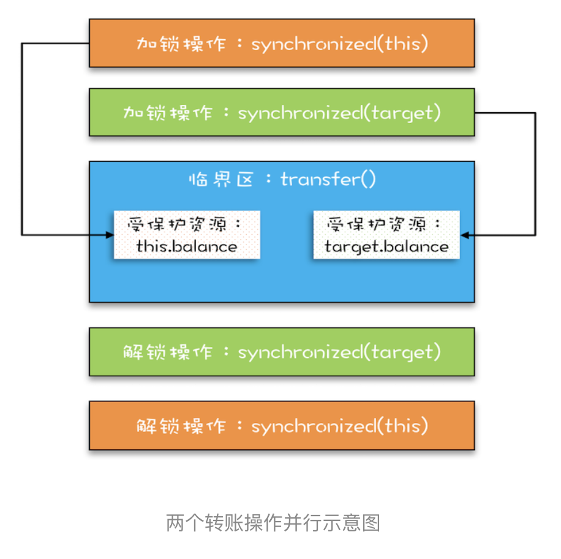
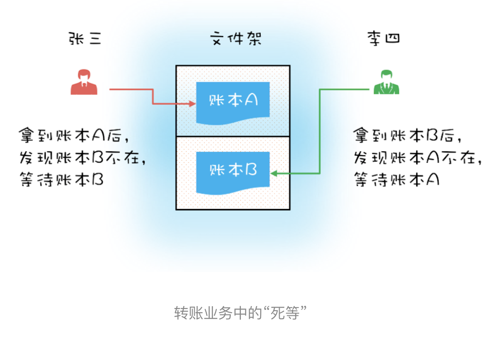
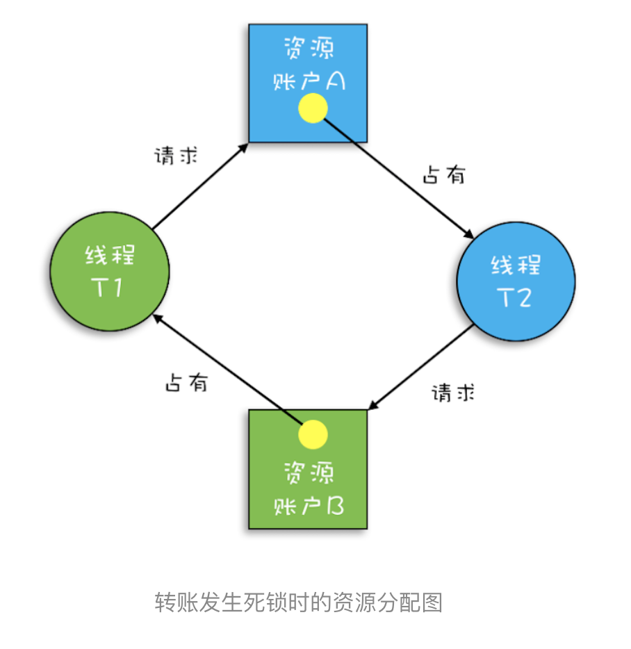
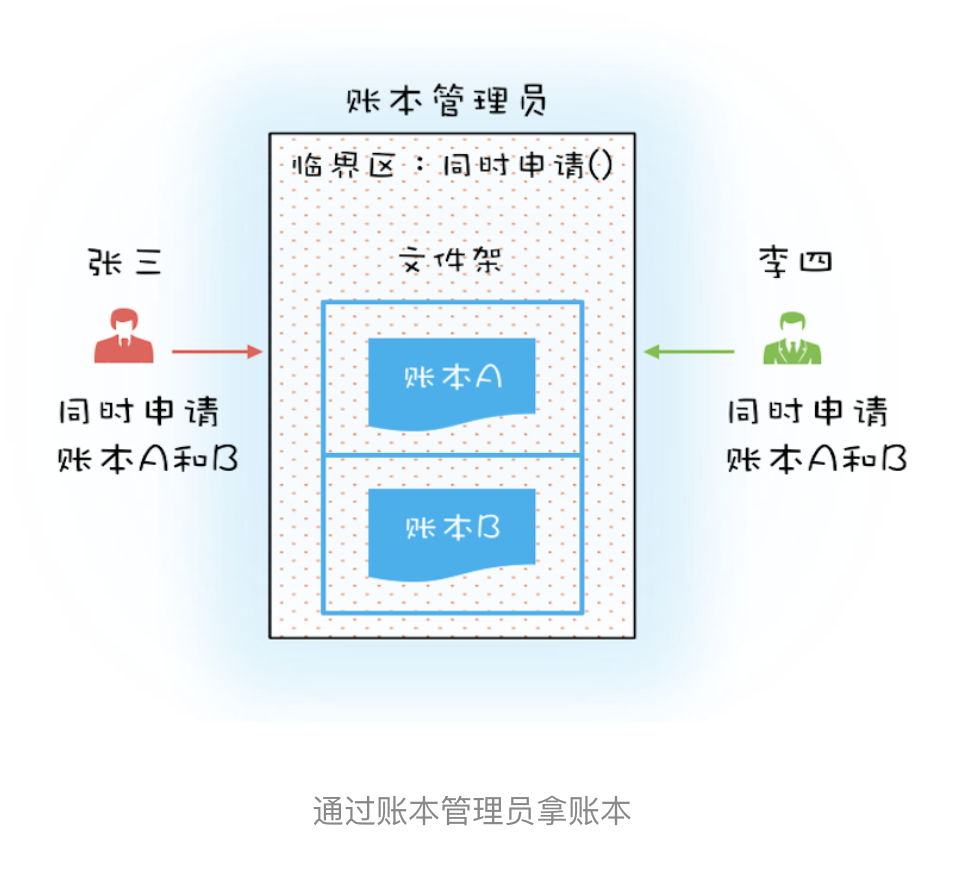

# 05 | 一不小心就死锁了，怎么办？

## 背景
在上一篇中，我们用Account.class来作为互斥锁，但是细想一下，这个锁粒度太大了，比如A给B转账，C给D转账，这种也会互斥，
都变成串行话了，效率太低，因此，需要优化！

## 思路：像现实世界要答案       
在古代，用账本来进行记账！一般柜台有转入账本和转出账本，柜员在拿账本时会有3种情况：      
- 1、柜台正好有转入账本，转出账本，那么柜员就全拿走
- 2、柜台有转入账本或者转出账本之一，那么柜员只能把有的这个先拿到手，然后等待着别人把另一个送回来
- 3、转出账本和转入账本都没有，那么就等待着别人把转入和转出账本都送回来

那么，在编程世界里这个问题很简单，我们用两把锁就解决了：转出账户一把锁，转入账户一把锁；在transfer方法内部，
先用this获取到转出账户的锁（先把转出账本拿到手），再在内部获取到转入账户的锁（再把转入账本拿到手），只有当两者都
成功时，我们才执行转账操作，逻辑如下图：
    
---
细的代码实现，如下所示:        
经过这样的优化后，账户 A 转账户 B 和账户 C 转账户 D 这两个转账操作就可以并行了       
```java
/**
 * @Author gaoqiangwei
 * @Date 2020/5/28 22:44
 * @Description
 */
public class Account {

    private Integer balance;

    public void transfer(Account target, Integer amt) {
        //锁定转出账户
        synchronized (this) {
            //锁定转入账户
            synchronized (target) {
                if (balance > amt) {
                    balance -= amt;
                    target.balance += amt;
                }
            }
        }
    }
}
```

## 没有免费的午餐
使用细粒度锁可以提高并行度，是性能优化的一个重要手段！但是，天下没有免费的午餐，细粒度锁带来的后果就是，会出现【死锁】！        

看一个特殊的例子：柜员1要做的是帮A给B转100元，柜员2要做的是帮B给A转100元，
这时，假设两个柜员去了柜台后，柜员1拿到了账本A，柜员2拿到了账本B，那么这时柜员1会等柜员2把账本B送回来，而柜员2会等柜员1把账本A送回来，        
那么，它们要等多久呢？？？一直等下去！因为它们都不会主动把账本送回去！姑且称为死等吧………………        
      
- - - 
> 死锁的一个比较专业的定义是：一组互相竞争资源的线程因互相等待，导致“永久”阻塞的现象。     

分析：     
```text
public class Account {

    private Integer balance;

    public void transfer(Account target, Integer amt) {
        //锁定转出账户
        synchronized (this) { ①
            //锁定转入账户
            synchronized (target) { ②
                if (balance > amt) {
                    balance -= amt;
                    target.balance += amt;
                }
            }
        }
    }
}
```

我们假设线程 T1 执行账户 A 转账户 B 的操作，账户 A.transfer(账户 B)；同时线程 T2 执行账户 B 转账户 A 的操作，账户 B.transfer(账户 A)。当 T1 和 T2 同时执行完①处的代码时，T1 获得了账户 A 的锁（对于 T1，this 是账户 A），而 T2 获得了账户 B 的锁（对于 T2，this 是账户 B）。之后 T1 和 T2 在执行②处的代码时，T1 试图获取账户 B 的锁时，发现账户 B 已经被锁定（被 T2 锁定），所以 T1 开始等待；T2 则试图获取账户 A 的锁时，发现账户 A 已经被锁定（被 T1 锁定），所以 T2 也开始等待。于是 T1 和 T2 会无期限地等待下去，也就是我们所说的死锁了。

- - - 

关于这种现象，我们还可以借助资源分配图来可视化锁的占用情况（资源分配图是个有向图，它可以描述资源和线程的状态）。
其中，资源用方形节点表示，线程用圆形节点表示；资源中的点指向线程的边表示线程已经获得该资源，线程指向资源的边则表示线程请求资源，
但尚未得到。转账发生死锁时的资源分配图就如下图所示，一个“各据山头死等”的尴尬局面。      
如下图：        
       

## 如何预防死锁？      
> 并发程序一旦死锁，一般没有特别好的方法，很多时候我们只能重启应用。因此，解决死锁问题最好的办法还是规避死锁。        

那如何避免死锁呢？要避免死锁就需要分析死锁发生的条件，有个叫 Coffman 的牛人早就总结过了，只有以下这四个条件都发生时才会出现死锁：       
- 1.互斥，共享资源X和Y只能被一个线程占用       
- 2.占有且等待，线程 T1 已经取得共享资源 X，在等待共享资源 Y 的时候，不释放共享资源 X；
- 3.不可抢占，其他线程不能强行抢占线程 T1 占有的资源；     
- 4.循环等待，线程 T1 等待线程 T2 占有的资源，线程 T2 等待线程 T1 占有的资源，就是循环等待。

反过来分析，也就是说只要我们破坏其中一个，就可以成功避免死锁的发生！！！        
1.互斥--------这个没办法避免，因为我们使用锁为的就是互斥（NO）            
2.占有且等待------我们要解决等待，我们可以一次性申请所有锁，这样就不存在等待了（YES）        
3.不可抢占-------占用部分资源的线程进一步申请其它资源时，如果获取不到锁那么就主动释放掉，这样不可抢占这个条件就被破坏掉了！（YES）
4.循环等待-------这个可以靠按序申请资源来预防。所谓按序申请，是指资源是有线性顺序的，申请的时候可以先申请资源序号小的，再申请资源序号大的，这样线性化后自然就不存在循环了。

我们已经从理论上解决了如何预防死锁，那么体现在代码上是：        
1、破坏占用且等待条件     
理论上讲，要破坏这个规则，那就是需要一次性申请所有资源，这个场景里资源分别是账本A和账本B，那么，可以引入一个账本管理员的角色，        
这个管理员管理着账本A和账本B，当只有一个账本时管理员不会拿给柜员，只有账本A和账本B都拿到时才会给柜员，这样就保证了一次性申请
所有资源！       
如图：
    
对应到编程领域，“同时申请”这个操作是一个临界区，我们也需要一个角色（Java 里面的类）来管理这个临界区，
我们就把这个角色定为 Allocator。它有两个重要功能，分别是：同时申请资源 apply() 和同时释放资源 free()。
账户 Account 类里面持有一个 Allocator 的单例（必须是单例，只能由一个人来分配资源）。
当账户 Account 在执行转账操作的时候，首先向 Allocator 同时申请转出账户和转入账户这两个资源，成功后再锁定这两个资源；
当转账操作执行完，释放锁之后，我们需通知 Allocator 同时释放转出账户和转入账户这两个资源。具体的代码实现如下。   
```java
/**
 * @Author gaoqiangwei
 * @Date 2020/5/28 23:24
 * @Description
 */
public class Allocator {
    private List<Object> lock = new ArrayList();
    //一次性申请所有资源
    synchronized boolean apply(Object from, Object to) {
        if (lock.contains(from) || lock.contains(to)) {
            return false;
        }
        lock.add(from);
        lock.add(to);
        return true;
    }
    //释放资源
    synchronized void free(Object from, Object to) {
        lock.remove(from);
        lock.remove(to);
    }
}

class Account1 {

    private Integer balance;

    //应该为单例
    private Allocator allocator;

    public void transfer(Account1 target, Integer amt) {
        while (allocator.apply(this,target)) {
            try {
                //锁定转出账户
                synchronized (this) {
                    //锁定转入账户
                    synchronized (target) {
                        if (balance > amt) {
                            balance -= amt;
                            target.balance += amt;
                        }
                    }
                }
            }finally {
                allocator.free(this,target);
            }
        }
    }
}
```


## 2.破坏不可抢占条件       
破坏不可抢占条件看上去很简单，核心是要能够主动释放它占有的资源，这一点 synchronized 是做不到的。
原因是 synchronized 申请资源的时候，如果申请不到，线程直接进入阻塞状态了，而线程进入阻塞状态，啥都干不了，也释放不了线程已经占有的资源。

你可能会质疑，“Java 作为排行榜第一的语言，这都解决不了？”
你的怀疑很有道理，Java 在语言层次确实没有解决这个问题，不过在 SDK 层面还是解决了的，
java.util.concurrent 这个包下面提供的 Lock 是可以轻松解决这个问题的。关于这个话题，咱们后面会详细讲。

## 3.破坏循环等待条件       
破坏这个条件，需要对资源进行排序，然后按序申请资源。这个实现非常简单，我们假设每个账户都有不同的属性 id，这个 id 可以作为排序字段，申请的时候，我们可以按照从小到大的顺序来申请。        
比如下面代码中，①~⑥处的代码对转出账户（this）和转入账户（target）排序，然后按照序号从小到大的顺序锁定账户。这样就不存在“循环”等待了。

```java
/**
 * @Author gaoqiangwei
 * @Date 2020/5/28 23:day42
 * @Description
 */
public class Account2 {
    private Integer id;
    private Integer balance;

    public void transfer(Account2 target, Integer amt) {
        Account2 left = this; //①
        Account2 right = target; //②
        if (this.id > target.id) { //③
            left = target; //④
            right = this; //⑤
        } //⑥
        // 锁定序号小的账户
        synchronized (left) {
            // 锁定序号大的账户
            synchronized (right) {
                if (balance > amt) {
                    balance -= amt;
                    target.balance += amt;
                }
            }
        }
    }
}
```


# 总结        
我们今天这一篇文章主要讲了用细粒度锁来锁定多个资源时，要注意死锁的问题。        
这个就需要你能把它强化为一个思维定势，遇到这种场景，马上想到可能存在死锁问题。     
当你知道风险之后，才有机会谈如何预防和避免，因此，识别出风险很重要。      

预防死锁主要是破坏三个条件中的一个，有了这个思路后，实现就简单了。
但仍需注意的是，有时候预防死锁成本也是很高的。例如上面转账那个例子，
我们破坏占用且等待条件的成本就比破坏循环等待条件的成本高，破坏占用且等待条件，
我们也是锁了所有的账户，而且还是用了死循环 while(!actr.apply(this, target));

方法，不过好在 apply() 这个方法基本不耗时。 在转账这个例子中，破坏循环等待条件就是成本最低的一个方案。


# 课后思考      

我们上面提到：破坏占用且等待条件，我们也是锁了所有的账户，而且还是用了死循环 while(!actr.apply(this, target));        

这个方法，那它比 synchronized(Account.class) 有没有性能优势呢？      


