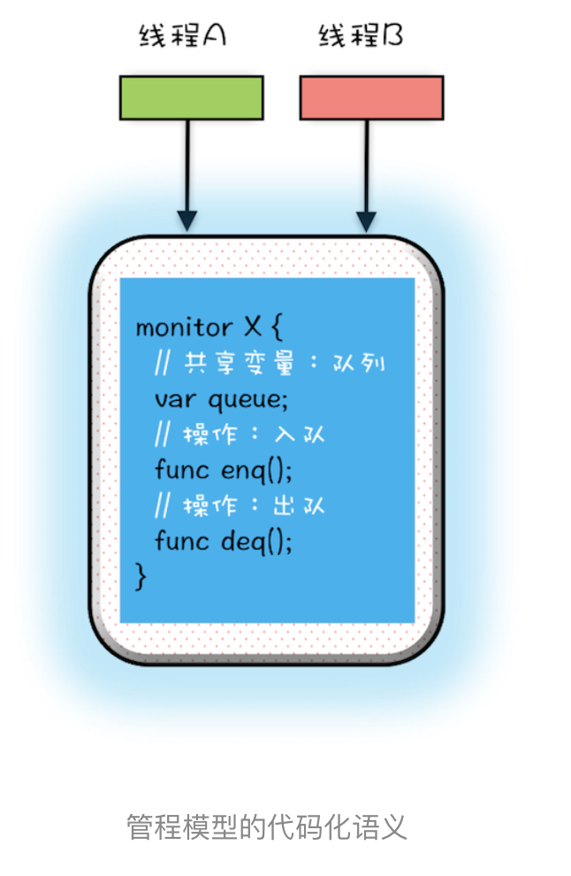
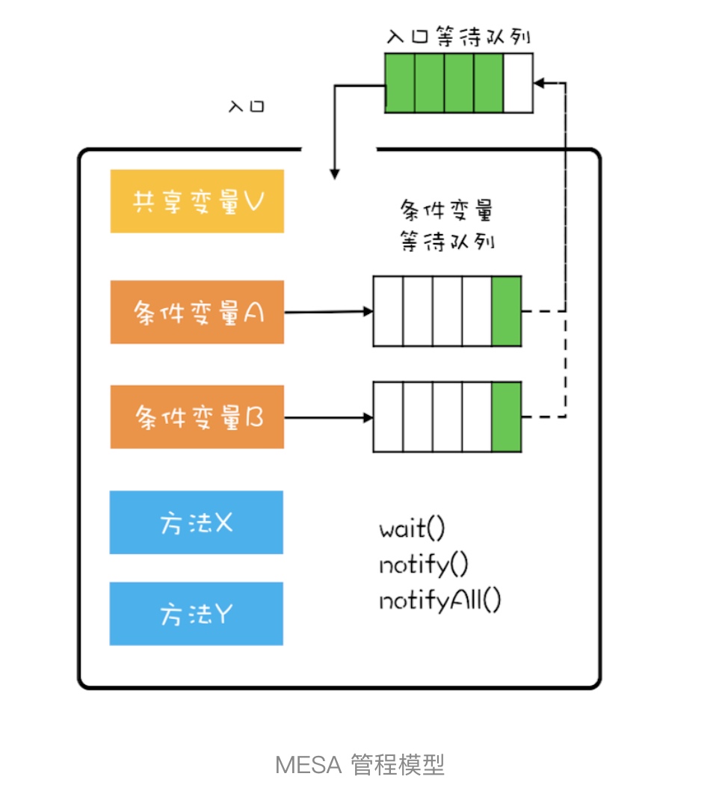
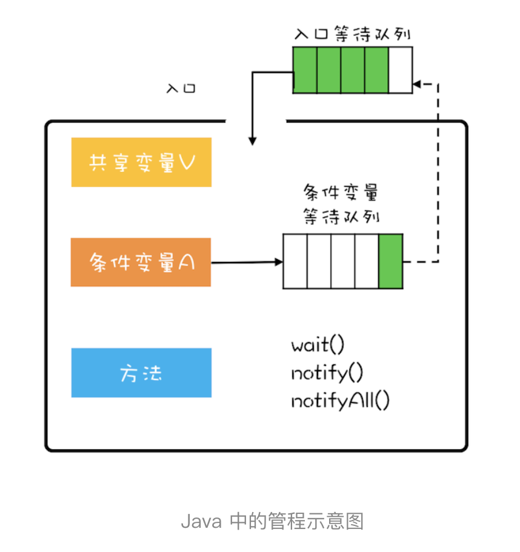

# 08 | 管程：并发编程的万能钥匙

# 背景        
并发编程这个技术领域已经发展了半个世纪了，有没有一种核心技术可以很方便地解决我们的并发问题呢？这个问题如果让我选择，我一定会选择管程技术。

# 管程        
> 管程，对应的英文是 Monitor，指的是管理共享变量以及对共享变量的操作过程，让他们支持并发。
（翻译为 Java 领域的语言，就是管理类的成员变量和成员方法，让这个类是线程安全的。）        

如何管呢？

# MESA模型
在管程的发展史上，先后出现过三种不同的管程模型，分别是：Hasen 模型、Hoare 模型和 MESA 模型。   
其中，现在广泛应用的是 MESA 模型
     
【问题】        
在并发编程领域，有两大核心问题：        
一个是互斥，即同一时刻只允许一个线程访问共享资源；       
另一个是同步，即线程之间如何通信、协作。这两大问题，管程都是能够解决的。        
        
【解决】        
互斥：     
思路，将共享变量及其对共享变量的操作统一封装起来！        

解释：     
> 图中，管程 X 将共享变量 queue 这个队列和相关的操作入队 enq()、出队 deq() 都封装起来了；线程 A 和线程 B 如果想访问共享变量 queue，只能通过调用管程提供的 enq()、deq() 方法来实现；enq()、deq() 保证互斥性，只允许一个线程进入管程。不知你有没有发现，管程模型和面向对象高度契合的。估计这也是 Java 选择管程的原因吧。而我在前面章节介绍的互斥锁用法，其背后的模型其实就是它。
        
同步：     
管程里还引入了条件变量的概念，而且每个条件变量都对应有一个等待队列，如下图，条件变量 A 和条件变量 B 分别都有自己的等待队列。       
        
那条件变量和等待队列的作用是什么呢？其实就是解决线程同步问题。     

解释：     
> 假设有个线程 T1 执行出队操作，不过需要注意的是执行出队操作，有个前提条件，就是队列不能是空的，而队列不空这个前提条件就是管程里的条件变量。 如果线程 T1 进入管程后恰好发现队列是空的，那怎么办呢？等待啊，去哪里等呢？就去条件变量对应的等待队列里面等。此时线程 T1 就去“队列不空”这个条件变量的等待队列中等待。这个过程类似于大夫发现你要去验个血，于是给你开了个验血的单子，你呢就去验血的队伍里排队。线程 T1 进入条件变量的等待队列后，是允许其他线程进入管程的。这和你去验血的时候，医生可以给其他患者诊治，道理都是一样的。
  
> 再假设之后另外一个线程 T2 执行入队操作，入队操作执行成功之后，“队列不空”这个条件对于线程 T1 来说已经满足了，此时线程 T2 要通知 T1，告诉它需要的条件已经满足了。当线程 T1 得到通知后，会从等待队列里面出来，但是出来之后不是马上执行，而是重新进入到入口等待队列里面。这个过程类似你验血完，回来找大夫，需要重新分诊。      
        
> 条件变量及其等待队列我们讲清楚了，下面再说说 wait()、notify()、notifyAll() 这三个操作。前面提到线程 T1 发现“队列不空”这个条件不满足，需要进到对应的等待队列里等待。这个过程就是通过调用 wait() 来实现的。如果我们用对象 A 代表“队列不空”这个条件，那么线程 T1 需要调用 A.wait()。同理当“队列不空”这个条件满足时，线程 T2 需要调用 A.notify() 来通知 A 等待队列中的一个线程，此时这个队列里面只有线程 T1。至于 notifyAll() 这个方法，它可以通知等待队列中的所有线程。        
        
# wait() 的正确姿势      
但是有一点，需要再次提醒，对于 MESA 管程来说，有一个编程范式，就是需要在一个 while 循环里面调用 wait()。这个是 MESA 管程特有的。       
```text
while(条件不满足) {
    wait();
}
```        
为什么是while呢？（高仔加戏）       
解释1：        
当线程被唤醒后，是从wait命令后开始执行的(不是从头开始执行该方法，这点上老师的示意图容易让人产生歧义)，而执行时间点往往跟唤醒时间点不一致，所以条件变量此时不一定满足了，所以通过while循环可以再验证，而if条件却做不到，它只能从wait命令后开始执行，所以要用while

解释2：        
```text
code1
if (条件不满足) {
    wait();
}
code2

说明：当调用wait()时，阻塞。被唤醒时，就直接执行code2了，没机会重新判断。
``` 

> Hasen 模型、Hoare 模型和 MESA 模型的一个核心区别就是当条件满足后，如何通知相关线程。管程要求同一时刻只允许一个线程执行，那当线程 T2 的操作使线程 T1 等待的条件满足时，T1 和 T2 究竟谁可以执行呢？
>> Hasen 模型里面，要求 notify() 放在代码的最后，这样 T2 通知完 T1 后，T2 就结束了，然后 T1 再执行，这样就能保证同一时刻只有一个线程执行。      
   Hoare 模型里面，T2 通知完 T1 后，T2 阻塞，T1 马上执行；等 T1 执行完，再唤醒 T2，也能保证同一时刻只有一个线程执行。但是相比 Hasen 模型，T2 多了一次阻塞唤醒操作。       
   MESA 管程里面，T2 通知完 T1 后，T2 还是会接着执行，T1 并不立即执行，仅仅是从条件变量的等待队列进到入口等待队列里面。这样做的好处是 notify() 不用放到代码的最后，T2 也没有多余的阻塞唤醒操作。但是也有个副作用，就是当 T1 再次执行的时候，可能曾经满足的条件，现在已经不满足了，所以需要以循环方式检验条件变量。


# notify() 何时可以使用       
前面说过关于notify()和notifyAll()，非经过深思熟虑，否则尽量使用 notifyAll()。

> 那什么时候可以使用 notify() 呢？需要满足以下三个     
> 1.所有等待线程拥有相同的等待条件；        
> 2.所有等待线程被唤醒后，执行相同的操作；   
> 3.只需要唤醒一个线程。      

反映在代码里就是下面这 3 行代码。对所有等待线程来说，都是执行这 3 行代码，重点是 while 里面的等待条件是完全相同的。        
```text
while (队列已满){
  // 等待队列不满
  notFull.await();
}
```    
    
所有等待线程被唤醒后执行的操作也是相同的，都是下面这几行：       
```text
/ 省略入队操作...
// 入队后, 通知可出队
notEmpty.signal();
```        
        
# 总结        
Java 参考了 MESA 模型，语言内置的管程（synchronized）对 MESA 模型进行了精简。MESA 模型中，条件变量可以有多个，Java 语言内置的管程里只有一个条件变量。具体如下图所示。      
 

Java 内置的管程方案（synchronized）使用简单，synchronized 关键字修饰的代码块，在编译期会自动生成相关加锁和解锁的代码，但是仅支持一个条件变量；而 Java SDK 并发包实现的管程支持多个条件变量，不过并发包里的锁，需要开发人员自己进行加锁和解锁操作。

并发编程里两大核心问题——互斥和同步，都可以由管程来帮你解决。学好管程，理论上所有的并发问题你都可以解决，并且很多并发工具类底层都是管程实现的，所以学好管程，就是相当于掌握了一把并发编程的万能钥匙。

# 课后练习      
wait() 方法，在 Hasen 模型和 Hoare 模型里面，都是没有参数的，而在 MESA 模型里面，增加了超时参数，你觉得这个参数有必要吗？       
        
        
        
        
        