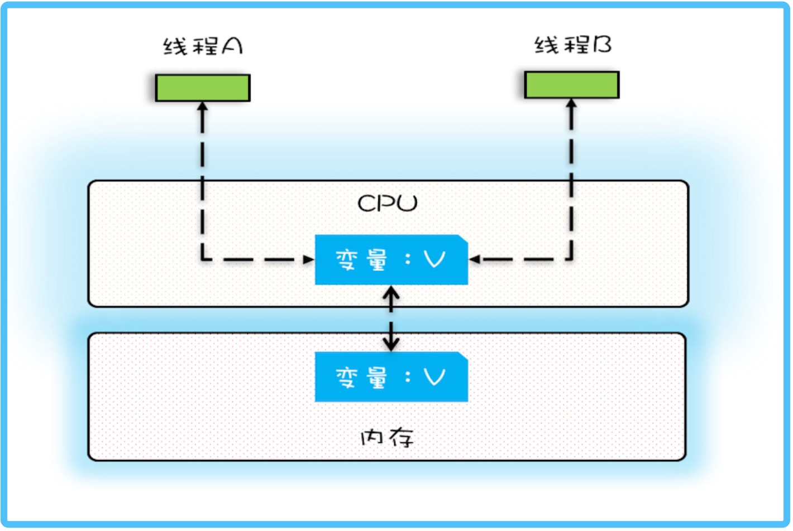
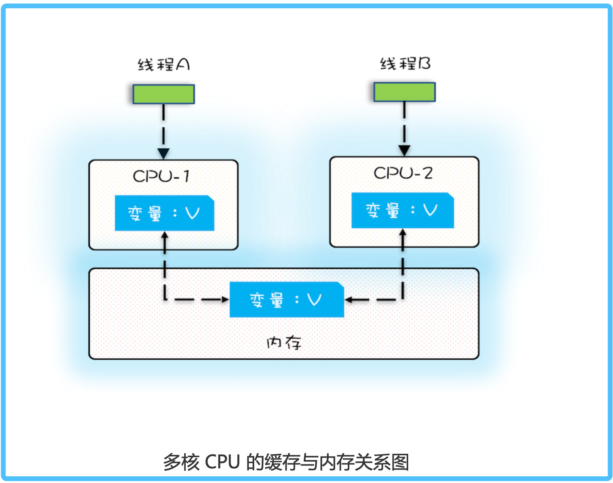

# 01 | 可见性、原子性和有序性问题:并发编程Bug的源头

## 背景
1.Speed: CPU>内存>I/0     
2.为了提高性能        
- 2.1 CPU增加了缓存
- 2.2 操作系统增加了进程/线程
- 2.3 编译进行指令重排序优化

## 源头之一、缓存导致的可见性问题
1.单核时代      
所有线程都是在一个CPU上执行，因为所有线程都是操作同一个 CPU 的缓存，因此是不会有问题的      
如图：     

> 一个线程对共享变量的修改，另外一个线程能够立刻看到，我们称为"可见性"

2.多核时代      
每个CPU都有自己的缓存，当多线程运行在不同的CPU上时，这些线程操作的是不同的CPU缓存。
这时，硬件程序员就给软件程序员挖了"坑"        
如图：     

实例：     
```java
public class Test01 {
    private int count = 0;
    private void add10k() {
        int start= 0;
        while (start++ < 10000) {
            count+=1;
        }
    }

    public static void main(String[] args) throws Exception{
        final Test01 test01 = new Test01();
        Thread t1 = new Thread(() -> {
            test01.add10k();
        });
        Thread t2 = new Thread(() -> {
            test01.add10k();
        });
        t1.start();
        t2.start();
        t1.join();
        t2.join();
        System.out.println("最终结果：" + test01.count);
    }
}
```
备注：直觉告诉我们应该是20000，但实际上是10000~20000之间，这就是多线程带来的问题

##源头之二、线程切换带来的原子性问题     
背景：     
> 由于IO太慢，早期操作系统发明了多进程，即操作系统允许某个进程执行一小段时间例如50ms，
过了50ms操作系统重新选择别的进程进行执行，这个称之为"任务切换"，50ms我们称为"时间片"        
如图：     


>java并发程序都是基于多线程的，因此自然也会涉及到任务切换。
我们现在基本都使用高级语言编程，高级语言里一条语句往往需要多条 CPU 指令完成，       
例 如上面代码中的count += 1，至少需要三条 CPU 指令。
指令1：首先，需要把count从内存加载到CPU寄存器
指令2：之后，在寄存器中执行+1操作
指令3：最后，将结果写入内存（缓存机制导致可能写入的是CPU缓存而不是内存）

操作系统做任务切换，可以发生在任意一条CPU指令执行完，注意：是CPU指令！！！而不是高级语言里的一条语句。  
    
现象描述：        
对于上面的三条指令来说，我们假设 count=0，如果线程 A 在指令 1 执行完后做线程切换，
线程 A 和线程 B 按照下图的序列执行，那么我们会发现 两个线程都执行了 count+=1 的操作，
但是得到的结果不是我们期望的 2，而是 1。      
如图：     

- 我们潜意识里面觉得 count+=1 这个操作是一个不可分割的整体，就像一个原子一样，
线程的切换可以发生在 count+=1 之前，也可以发生在 count+=1 之后，但就是不会发生 在中间。
> 我们把一个或者多个操作在 CPU 执行的过程中不被中断的特性称为原子性。
- CPU 能保证的原子操作是 CPU 指令级别的，而不是高级语言的操作符，这是违背我们直 觉的地方。
因此，很多时候我们需要在高级语言层面保证操作的原子性。

##源头之三、编译优化带来的有序性问题     
背景：     
>那并发编程里还有没有其他有违直觉容易导致诡异 Bug 的技术呢?有的，就是有序性。
顾名思义，有序性指的是程序按照代码的先后顺序执行。
编译器为了优化性能，有时候会改变程序中语句的先后顺序，例如程序中:“a=6;b=7;”编译器优化后可能变 成“b=7;a=6;”，
在这个例子中，编译器调整了语句的顺序，但是不影响程序的最终 结果。不过有时候编译器及解释器的优化可能导致意想不到的 Bug。

经典例子：利用双重检查创建单例对象       
> 例如下面的代码:在获取实 例 getInstance() 的方法中，我们首先判断 instance 是否为空，如果为空，则锁定 Singleton.class 并再次检查 instance 是否为空，如果还为空则创建 Singleton 的一个实 例。
```java
class Singleton {

    static Singleton instance;

    static Singleton getInstance() {
        if (instance == null) {
            synchronized (Singleton.class) {
                if (instance == null) {
                    instance = new Singleton();
                }
            }
        }
        return instance;
    }
}
```
正常推理：      
>假设有两个线程 A、B 同时调用 getInstance() 方法，他们会同时发现 instance == null ，于是同时对 Singleton.class 加锁，此时 JVM 保证只有一个线程能够加锁成功
 (假设是线程 A)，另外一个线程则会处于等待状态(假设是线程 B);线程 A 会创建一 个 Singleton 实例，之后释放锁，锁释放后，线程 B 被唤醒，线程 B 再次尝试加锁，此 时是可以加锁成功的，加锁成功后，线程 B 检查 instance == null 时会发现，已经创 建过 Singleton 实例了，所以线程 B 不会再创建一个 Singleton 实例。

这看上去一切都很完美，无懈可击，但实际上这个 getInstance() 方法并不完美。问题出 在哪里呢?
出在 new 操作上，我们以为的 new 操作应该是:
```text
1. 分配一块内存 M;
2. 在内存 M 上初始化 Singleton 对象; 
3. 然后 M 的地址赋值给 instance 变量。
```
但是实际上优化后的执行路径却是这样的:
```text
1. 分配一块内存 M;
2. 将 M 的地址赋值给 instance 变量;
3. 最后在内存 M 上初始化 Singleton 对象。
```
解释： 
```text
优化后会导致什么问题呢?我们假设线程 A 先执行 getInstance() 方法，当执行完指令 
2 时恰好发生了线程切换，切换到了线程 B 上;如果此时线程 B 也执行 getInstance() 方 法，
那么线程 B 会发现instance != null，所以直接返回 instance，
而此时的 instance 是没有初始化过的，如果我们这个时候访问 instance 的成员变量就可能触发空 指针异常。
```
如图：     
      

## 总结
> 要写好并发程序，首先要知道并发程序的问题在哪里，只有确定了“靶子”，才有可能把 问题解决，毕竟所有的解决方案都是针对问题的。并发程序经常出现的诡异问题看上去非 常无厘头，但是深究的话，无外乎就是直觉欺骗了我们，只要我们能够深刻理解可见性、 原子性、有序性在并发场景下的原理，很多并发 Bug 都是可以理解、可以诊断的。

>在介绍可见性、原子性、有序性的时候，特意提到缓存导致的可见性问题，线程切换带来 的原子性问题，编译优化带来的有序性问题，其实缓存、线程、编译优化的目的和我们写 并发程序的目的是相同的，都是提高程序性能。但是技术在解决一个问题的同时，必然会 带来另外一个问题，所以在采用一项技术的同时，一定要清楚它带来的问题是什么，以及 如何规避。


## 思考
问题：     
常听人说，在 32 位的机器上对 long 型变量进行加减操作存在并发隐患，到底是不是这样 呢?

解答：     
long类型64位，所以在32位的机器上，对long类型的数据操作通常需要多条指令组合出来，，无法保证原子性，所以并发的时候会出问题