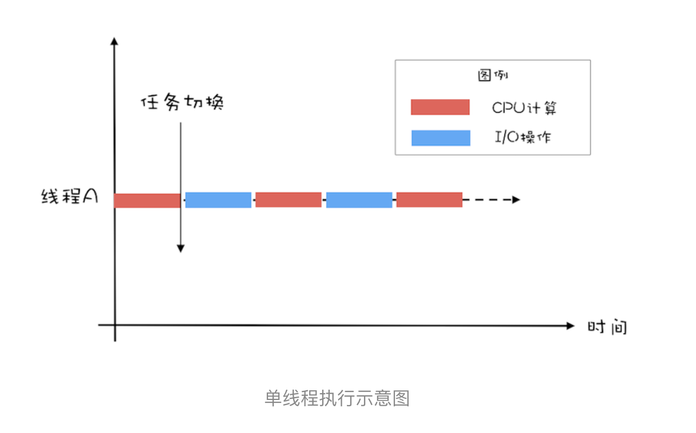
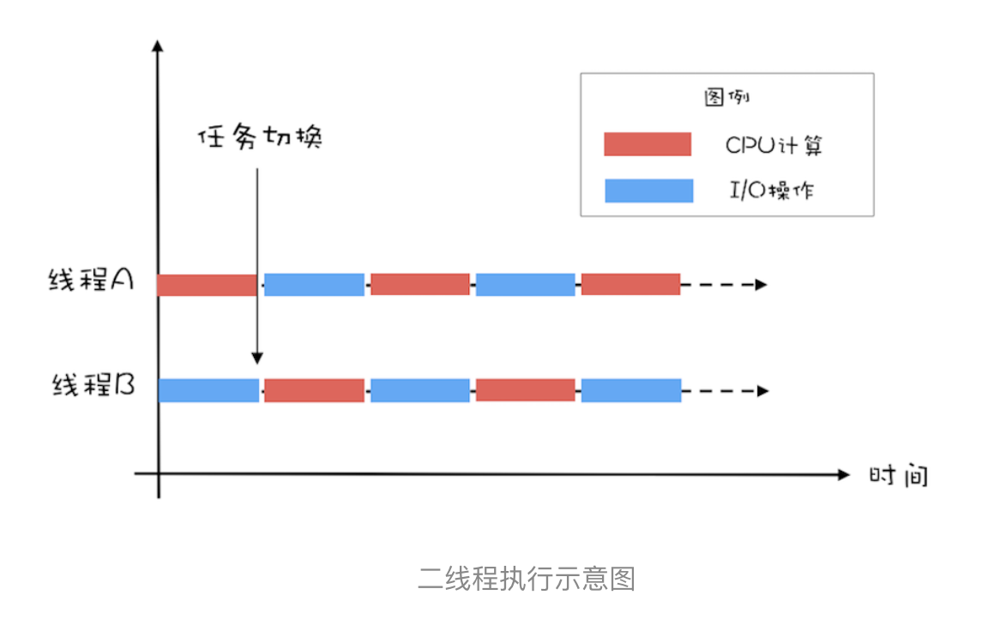
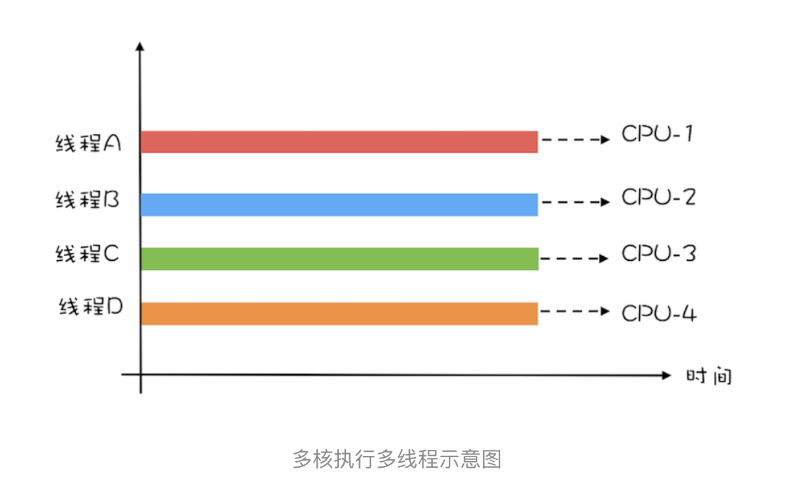
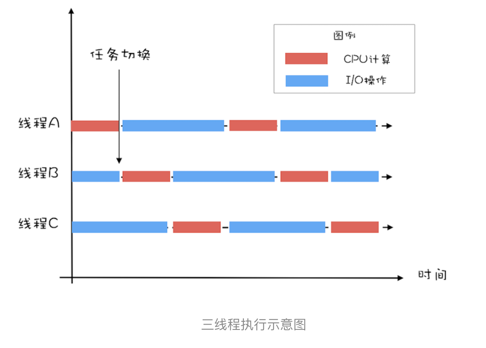

# 10 | Java线程（中）：创建多少线程才是合适的？

## 背景       
java领域实现并发的手段就是多线程，那线程数该设置多少呢？      
要解决这个问题，需要分析2个问题：       
1、为什么要使用多线程？        
2、多线程的应用场景有哪些？      

## 为什么要使用多线程？       
本质：提升程序性能！      
有2个指标：延迟和吞吐量        
①延迟：延迟指的是发出请求到收到响应这个过程的时间；延迟越短，意味着程序执行得越快，性能也就越好。
②吞吐量：吞吐量指的是在单位时间内能处理请求的数量。

所谓提升性能，就是降低延迟&提高吞吐量，这就是使用多线程的目的

# 多线程应用场景
要想“降低延迟，提高吞吐量”，对应的方法呢，基本上有两个方向，一个方向是【优化算法】，另一个方向是【将硬件的性能发挥到极致】。 前者属于算法领域，后者属于并发编程领域。    
那么在并发编程领域，提升性能本质上就是提升硬件的利用率，再具体点来说，就是提升 I/O 的利用率和 CPU 的利用率。       

疑问：操作系统不是已经解决了硬件利用率了吗？
回答：是的，操作系统解决的是单个的硬件利用率，但是综合的利用率没有解决，但是留给了我们个方案：就是多线程

如何利用多线程提升IO和CPU利用率呢？        
假设程序按照 CPU 计算和 I/O 操作交叉执行的方式运行，而且 CPU 计算和 I/O 操作的耗时是 1:1
如图1：        
假设1:        
只有1个线程，执行IO时CPU空闲，执行CPU时IO空闲，那么单位时间内的利用就是50%
      
       
假设2：        

如果有两个线程，线程A执行CPU计算，线程B执行IO操作，下一次，线程A执行IO操作，线程B执行CPU计算       
样 CPU 的利用率和 I/O 设备的利用率就都达到了 100%

【结论】很容易看出，单位时间内处理的请求数翻了一番，对性能影响就是吞吐量提高了1倍
（换句话：如果观察到 CPU 和 I/O 设备的利用率都很低，那么可以尝试通过增加线程来提高吞吐量。）

分析：     
单核时代，多线程主要就是用来平衡 CPU 和 I/O 设备的。如果程序只有 CPU 计算，而没有 I/O 操作的话，多线程不但不会提升性能，还会使性能变得更差     
多核时代，多线程即使都是CPU计算型，也可以提高性能      
形象解释一下：     
假如要计算1+2……+100亿，如果在 4 核的 CPU 上利用 4 个线程执行，       
- 线程 A 计算 [1，25 亿)
- 线程 B 计算 [25 亿，50 亿)
- 线程 C 计算 [50，75 亿)
- 线程 D 计算 [75 亿，100 亿]      
之后汇总，那么理论上应该比一个线程计算 [1，100 亿] 快将近 4 倍，响应时间能够降到 25%。
（一个线程，对于 4 核的 CPU，CPU 的利用率只有 25%，而 4 个线程，则能够将 CPU 的利用率提高到 100%）     
     

# 创建多少线程合适呢？        
创建多少线程合适要看具体应用场景，一般程序都是IO密集型和CPU密集型交叉执行，而一般IO密集型会比CPU密集型操作慢很多       

I/O 密集型程序和 CPU 密集型程序，计算最佳线程数的方法是不同的。下面分两个场景来计算下：

-  CPU 密集型计算        
【多线程本质上是提升多核 CPU 的利用率】      
所以对于一个 4 核的 CPU，每个核一个线程，理论上创建 4 个线程就可以了，再多创建线程也只是增加线程切换的成本。
所以，对于 CPU 密集型的计算场景，理论上“线程的数量 =CPU 核数”就是最合适的。        
不过在工程上，线程的数量一般会设置为“CPU 核数 +1”，这样的话，当线程因为偶尔的内存页失效或其他原因导致阻塞时，这个额外的线程可以顶上，从而保证 CPU 的利用率。

- IO密集型     
对于 I/O 密集型的计算场景，比如前面我们的例子中，如果 CPU 计算和 I/O 操作的耗时是 1:1，
那么 2 个线程是最合适的。如果 CPU 计算和 I/O 操作的耗时是 1:2，那多少个线程合适呢？是 3 个线程，
如下图所示：CPU 在 A、B、C 三个线程之间切换，对于线程 A，当 CPU 从 B、C 切换回来时，线程 A 正好执行完 I/O 操作。这样 CPU 和 I/O 设备的利用率都达到了 100%。
        

通过上面这个例子，我们会发现，对于 I/O 密集型计算场景，最佳的线程数是与程序中 CPU 计算和 I/O 操作的耗时比相关的，我们可以总结出这样一个公式：

最佳线程数 =1 +（I/O 耗时 / CPU 耗时）

我们令 R=I/O 耗时 / CPU 耗时，综合上图，可以这样理解：当线程 A 执行 IO 操作时，另外 R 个线程正好执行完各自的 CPU 计算。这样 CPU 的利用率就达到了 100%。

不过上面这个公式是针对单核 CPU 的，至于多核 CPU，也很简单，只需要等比扩大就可以了，计算公式如下：

最佳线程数 =CPU 核数 * [ 1 +（I/O 耗时 / CPU 耗时）]

# 总结        
很多人都知道线程数不是越多越好，但是设置多少是合适的，却又拿不定主意。其实只要把握住一条原则就可以了，这条原则就是将硬件的性能发挥到极致。上面我们针对 CPU 密集型和 I/O 密集型计算场景都给出了理论上的最佳公式，这些公式背后的目标其实就是将硬件的性能发挥到极致。

对于 I/O 密集型计算场景，I/O 耗时和 CPU 耗时的比值是一个关键参数，不幸的是这个参数是未知的，而且是动态变化的，所以工程上，我们要估算这个参数，然后做各种不同场景下的压测来验证我们的估计。不过工程上，原则还是将硬件的性能发挥到极致，所以压测时，我们需要重点关注 CPU、I/O 设备的利用率和性能指标（响应时间、吞吐量）之间的关系。

# 课后思考
有些同学对于最佳线程数的设置积累了一些经验值，认为对于 I/O 密集型应用，最佳线程数应该为：2 * CPU 的核数 + 1，你觉得这个经验值合理吗？

# 精选留言
>更多的精力其实应该放在算法的优化上，线程池的配置，按照经验配置一个，随时关注线程池大小对程序的影响即可，具体做法：可以为你的程序配置一个全局的线程池，需要异步执行的任务，扔到这个全局线程池处理，线程池大小按照经验设置，每隔一段时间打印一下线程池的利用率，做到心里有数。     
>看到过太多的代码，遇到要执行一个异步任务就创建一个线程池，导致整个程序的线程池大到爆，完全没必要。而且大多数时候，提高吞吐量可以通过使用缓存、优化业务逻辑、提前计算好等方式来处理，真没有必要太过于关注线程池大小怎么配置，如果小了就改大一点，大了改小一点就好，从老师本文的篇幅也可以看出来。       
>经验值不靠谱的另外一个原因，大多数情况下，一台服务器跑了很多程序，每个程序都有自己的线程池，那CPU如何分配？还是根据实际情况来确定比较好。

