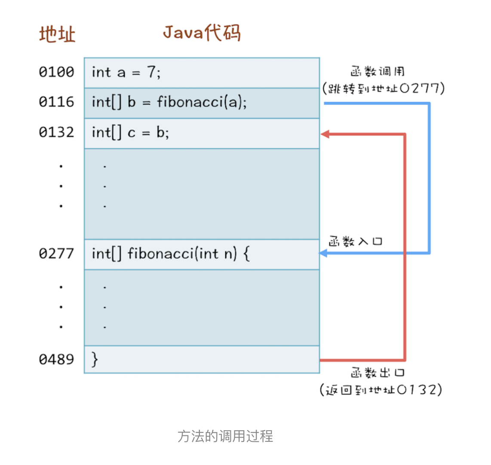
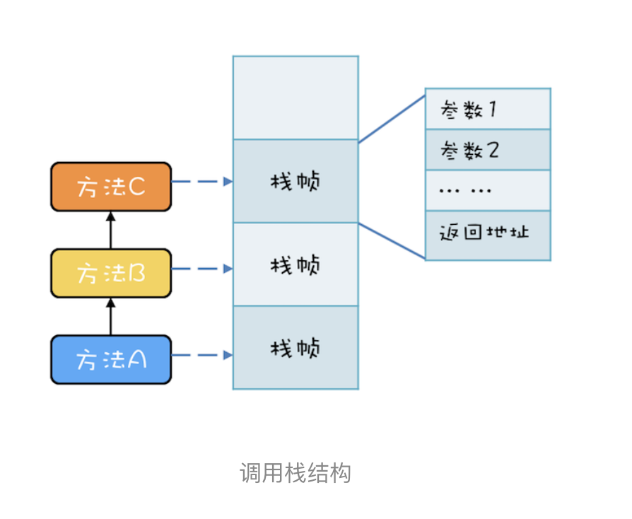
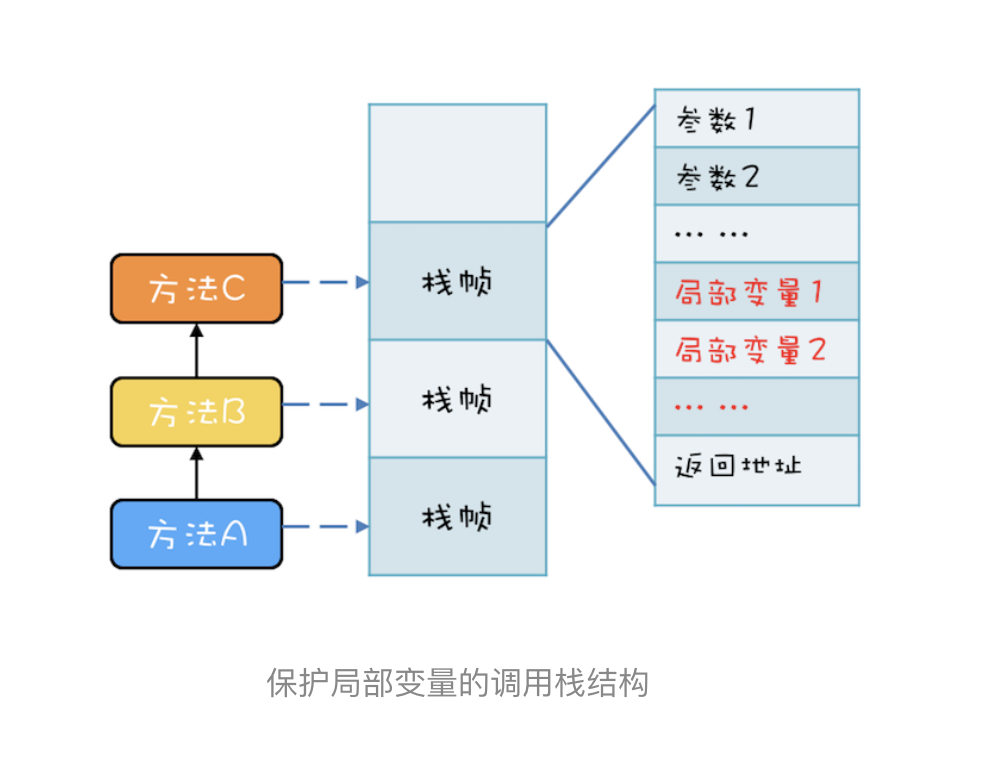
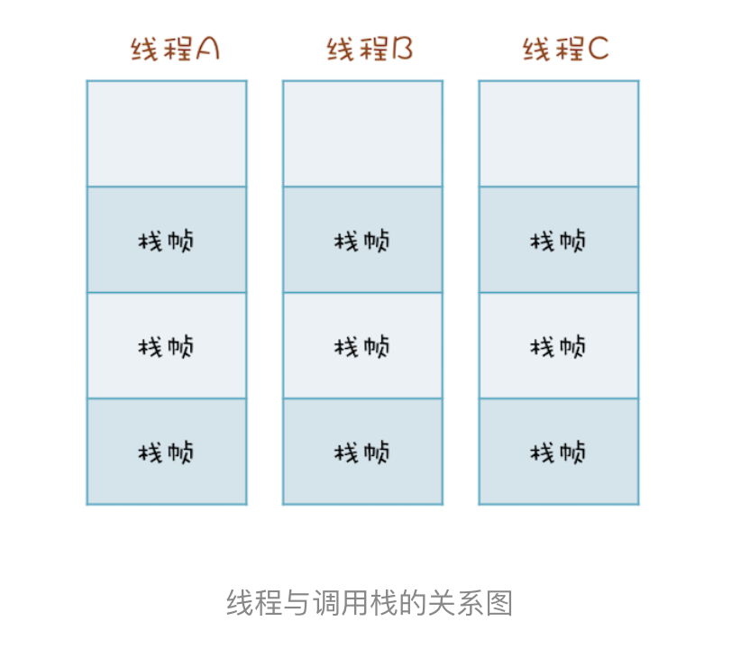

# 11 | Java线程（下）：为什么局部变量是线程安全的？

# 背景        
我们一遍一遍重复再重复地讲到，多个线程同时访问共享变量的时候，会导致并发问题。那局部变量会不会存在并发呢？       
其实很多人也是知道局部变量不存在数据竞争的，但是至于原因嘛，就说不清楚了。

那它背后的原因到底是怎样的呢？要弄清楚这个，你需要一点编译原理的知识。你知道在 CPU 层面，是没有方法概念的，CPU 的眼里，只有一条条的指令。编译程序，负责把高级语言里的方法转换成一条条的指令。所以你可以站在编译器实现者的角度来思考“怎么完成方法到指令的转换”。

# 方法是如何执行的？
高级语言翻译成 CPU 的指令相对简单，可方法的调用就比较复杂了。例如下面这三行代码：
- 第 1 行，声明一个 int 变量 a；
- 第 2 行，调用方法 fibonacci(a)；
- 第 3 行，将 b 赋值给 c。

```text
int a = 7；
int[] b = fibonacci(a);
int[] c = b;
```
解释：     
当你调用 fibonacci(a) 的时候，CPU 要先找到方法 fibonacci() 的地址，然后跳转到这个地址去执行代码，最后 CPU 执行完方法 fibonacci() 之后，要能够返回。然后找到调用方法的下一条语句的地址：也就是int[] c=b的地址，再跳转到这个地址去执行。

如下图：


到这里，方法调用的过程想必你已经清楚了，但是还有一个很重要的问题，“CPU 去哪里找到调用方法的参数和返回地址？”       
如果你熟悉 CPU 的工作原理，你应该会立刻想到：【通过 CPU 的堆栈寄存器】。CPU 支持一种栈结构，栈你一定很熟悉了，就像手枪的弹夹，先入后出。因为这个栈是和方法调用相关的，因此经常被称为【调用栈】。

- - - 
例如，有三个方法 A、B、C，他们的调用关系是 A->B->C（A 调用 B，B 调用 C），在运行时，会构建出下面这样的调用栈。       

解释：     
每个方法在调用栈里都有自己的独立空间，称为【栈帧】，每个栈帧里都有对应方法需要的参数和返回地址。
当调用方法时，会创建新的栈帧，并压入调用栈；当方法返回时，对应的栈帧就会被自动弹出。
也就是说，【栈帧和方法是同生共死的】。

> 利用栈结构来支持方法调用这个方案非常普遍，以至于 CPU 里内置了栈寄存器。虽然各家编程语言定义的方法千奇百怪，但是方法的内部执行原理却是出奇的一致：都是靠栈结构解决的。Java 语言虽然是靠虚拟机解释执行的，但是方法的调用也是利用栈结构解决的。

# 局部变量存哪里？      
局部变量的作用域是方法内部，也就是说当方法执行完，局部变量就没用了，局部变量应该和方法同生共死。        
此时你应该会想到调用栈的栈帧，调用栈的栈帧就是和方法同生共死的，所以局部变量放到调用栈里那儿是相当的合理。事实上，的确是这样的，局部变量就是放到了调用栈里。      
于是调用栈的结构就变成了下图这样:


> 这个结论相信很多人都知道，因为学 Java 语言的时候，基本所有的教材都会告诉你 new 出来的对象是在堆里，局部变量是在栈里，只不过很多人并不清楚堆和栈的区别，以及为什么要区分堆和栈。现在你应该很清楚了，局部变量是和方法同生共死的，一个变量如果想跨越方法的边界，就必须创建在堆里。
>(高仔白话：篮球场是要让大家玩的，所以要建在广场，如果建在你自己家，那就只能自己玩了，别人玩不了了，所以要区分堆栈，共享的东西要放堆上，自己使用的的放栈上；)


# 调用栈与线程（自己以前的疑问，哈哈）
两个线程可以同时用不同的参数调用相同的方法，那调用栈和线程之间是什么关系呢？答案是：【每个线程都有自己独立的调用栈】      
因为如果不是这样，那两个线程就互相干扰了。如下面这幅图所示，线程 A、B、C 每个线程都有自己独立的调用栈

现在，让我们回过头来再看篇首的问题：Java 方法里面的局部变量是否存在并发问题？现在你应该很清楚了，一点问题都没有。因为每个线程都有自己的调用栈，局部变量保存在线程各自的调用栈里面，不会共享，所以自然也就没有并发问题。
【再次重申一遍：没有共享，就没有伤害】

# 线程封闭      
方法里的局部变量，因为不会和其他线程共享，所以没有并发问题，这个思路很好，已经成为解决并发问题的一个重要技术，同时还有个响当当的名字叫做线程封闭，
比较官方的解释是：【仅在单线程内访问数据】。由于不存在共享，所以即便不同步也不会有并发问题，性能杠杠的。

采用线程封闭技术的案例非常多，例如从数据库连接池里获取的连接 Connection，在 JDBC 规范里并没有要求这个 Connection 必须是线程安全的。数据库连接池通过线程封闭技术，保证一个 Connection 一旦被一个线程获取之后，在这个线程关闭 Connection 之前的这段时间里，不会再分配给其他线程，从而保证了 Connection 不会有并发问题。

# 总结
> 调用栈是一个通用的计算机概念，所有的编程语言都会涉及到，Java 调用栈相关的知识，我并没有花费很大的力气去深究，但是靠着那点 C 语言的知识，稍微思考一下，基本上也就推断出来了。工作了十几年，我发现最近几年和前些年最大的区别是：很多技术的实现原理我都是靠推断，然后看源码验证，而不是像以前一样纯粹靠看源码来总结了。
  
  建议你也多研究原理性的东西、通用的东西，有这些东西之后再学具体的技术就快多了。


# 课后思考      
常听人说，递归调用太深，可能导致栈溢出。你思考一下原因是什么？有哪些解决方案呢？

解决方式：
- 递归一般都可以改写成for循环
- 限制递归次数，当深入到某个值就不允许继续再递归调用了
- 采用尾递归

       
> 尾递归原理：        
当编译器检测到一个函数调用是尾递归的时候，它就覆盖当前的活动记录而不是在栈中去创建一个新的。编译器可以做到这点，因为递归调用是当前活跃期内最后一条待执行的语句，于是当这个调用返回时栈帧中并没有其他事情可做，因此也就没有保存栈帧的必要了。通过覆盖当前的栈帧而不是在其之上重新添加一个，这样所使用的栈空间就大大缩减了，这使得实际的运行效率会变得更高。
原文链接：https://blog.csdn.net/Vermont_/java/article/details/84557065

javascript代码：     
```text

function recsum(x) {
    if (x===1) {
        return x;
    } else {
        return x + recsum(x-1);
    }
}

如果你调用recsum(5)，JavaScript解释器将会按照下面的次序来计算：
recsum(5)
5 + recsum(4)
5 + (4 + recsum(3))
5 + (4 + (3 + recsum(2)))
5 + (4 + (3 + (2 + recsum(1))))
5 + (4 + (3 + (2 + 1)))
15
注意在JavaScript解释器计算recsum（5）之前，每个递归调用必须全部完成。
```

改写成尾递归：     
```text

function tailrecsum(x, running_total=0) {
    if (x===0) {
        return running_total;
    } else {
        return tailrecsum(x-1, running_total+x);
    }
}
```
下面是当你调用tailrecsum(5)的时候实际的事件调用顺序：
```text
tailrecsum(5, 0)
tailrecsum(4, 5)
tailrecsum(3, 9)
tailrecsum(2, 12)
tailrecsum(1, 14)
tailrecsum(0, 15)
15
在尾递归的情况下，每次递归调用的时候，running_total都会更新。
```


