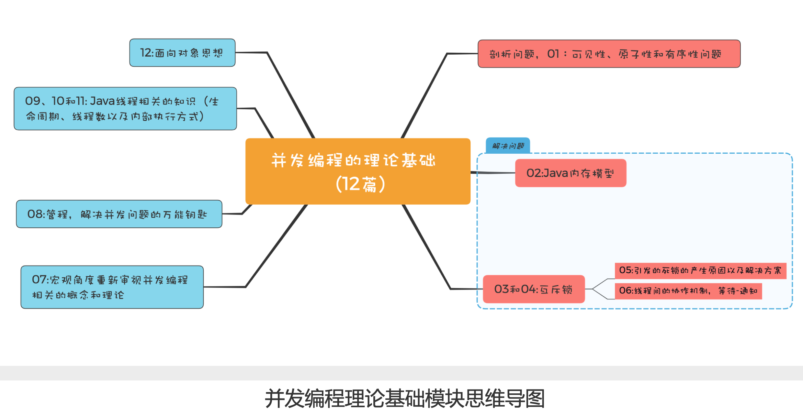

# 13 | 理论基础模块热点问题答疑

# 背景
专栏的第一模块——并发编程的理论基础，我们已经讲解完了，总共 12 篇，下面我会先将这些知识点再简单地为你“串”一下，咱们一 起复习下;

# “串行的故事”

- 起源是一个硬件的核心矛盾:CPU 与内存、I/O 的速度差异，系统软件(操作系统、编译 器)在解决这个核心矛盾的同时，引入了可见性、原子性和有序性问题，这三个问题就是很 多并发程序的 Bug 之源。这，就是01的内容。

- 那如何解决这三个问题呢?Java 语言自然有招儿，它提供了 Java 内存模型和互斥锁方案。所 以，在02我们介绍了 Java 内存模型，以应对可见性和有序性问题;那另一个原子性问题该如 何解决?多方考量用好互斥锁才是关键，这就是03和04的内容。

- 虽说互斥锁是解决并发问题的核心工具，但它也可能会带来死锁问题，所以05就介绍了死锁 的产生原因以及解决方案;同时还引出一个线程间协作的问题，这也就引出了06这篇文章的 内容，介绍线程间的协作机制:等待 - 通知。

- 你应该也看出来了，前六篇文章，我们更多地是站在微观的角度看待并发问题。而07则是换 一个角度，站在宏观的角度重新审视并发编程相关的概念和理论，同时也是对前六篇文章的 查漏补缺。

- 08介绍的管程，是 Java 并发编程技术的基础，是解决并发问题的万能钥匙。并发编程里两大 核心问题——互斥和同步，都是可以由管程来解决的。所以，学好管程，就相当于掌握了一 把并发编程的万能钥匙。
  至此，并发编程相关的问题，理论上你都应该能找到问题所在，并能给出理论上的解决方案 了。
  
- 而后在09、10和11我们又介绍了线程相关的知识，毕竟 Java 并发编程是要靠多线程来实现 的，所以有针对性地学习这部分知识也是很有必要的，包括线程的生命周期、如何计算合适 的线程数以及线程内部是如何执行的。

- 最后，在12我们还介绍了如何用面向对象思想写好并发程序，因为在 Java 语言里，面向对象 思想能够让并发编程变得更简单。


- - - 
# 对课后题以及热门评论做下总结

# 01 用锁的最佳实践
03和04的思考题都是关于如何正确的创建锁，思考题里做法是错误的。       

- - - 
03的思考题的示例代码如下：synchronized(new Object()),
这行代码很多同学已经分 析出来了，每次调用方法 get()、addOne() 都创建了不同的锁，相当于无锁。      
这里需要你再
次加深一下记忆，“【一个合理的受保护资源与锁之间的关联关系应该是 N:1】”。也就是说，只有共享一 把锁才能起到互斥的作用。      

另外，很多同学也提到，JVM 开启逃逸分析之后，synchronized (new Object()) 这行 代码在实际执行的时候会被优化掉，也就是说在真实执行的时候，这行代码压根就不存在。

```java
class SafeCalc {
    Long value = 1L;
    public Long get() {
        synchronized (new Object()) {
            return value;
        }
    }
    public void set(Long value) {
        synchronized (new Object()) {
            valkue += 1;
        }
    }
}
```
 - - - 
 
 04的思考题转换成代码，是下面这个样子。它的核心问题有两点:一个是锁有可能会变化， 
 另一个是 【Integer 和 String 类型的对象不适合做锁】。如果锁发生变化，就意味着失去了互斥 功能。 
 Integer 和 String 类型的对象在 JVM 里面是可能被重用的，
 除此之外，JVM 里可能 被重用的对象还有 Boolean，那重用意味着什么呢?
 意味着你的锁可能被其他代码使用，如 果其他代码 synchronized(你的锁)，而且不释放，那你的程序就永远拿不到锁，
 这是隐藏 的风险。 
```java
    class Account {
    // 账户余额
    private Integer balance;
    // 账户密码
    private String password; //取款
    void withdraw(Integer amt) {
    synchronized(balance) {
        if (this.balance > amt){
        this.balance -= amt; }
        } 
    }
    // 更改密码
    void updatePassword(String pw){
        synchronized(password) { this.password = pw;
        } 
    }
}
```
通过这两个反例，我们可以总结出这样一个基本的原则:【锁，应是私有的、不可变的、不可 重用的】。
> 我们经常看到别人家的锁，都长成下面示例代码这样，这种写法貌不惊人，却能避 免各种意想不到的坑，这个其实就是最佳实践。
```text
// 普通对象锁
private final Object lock = new Object();
// 静态对象锁
private static final Object lock = new Object();
```       

# 02. 锁的性能要看场景
《05 | 一不小心就死锁了，怎么办?》的思考题是比较while(!actr.apply(this,
target));这个方法和synchronized(Account.class)的性能哪个更好。

这个要看具体的应用场景，不同应用场景它们的性能表现是不同的。在这个思考题里面，如 果转账操作非常费时，那么前者的性能优势就显示出来了，因为前者允许 A->B、C->D 这种 转账业务的并行。

> 不同的并发场景用不同的方案，这是并发编程里面的一项基本原则;没有 通吃的技术和方案，因为每种技术和方案都是优缺点和适用场景的。

# 03. 竞态条件需要格外关注
《07 | 安全性、活跃性以及性能问题》里的思考题是一种典型的竞态条件问题(如下所 示)。竞态条件问题非常容易被忽略，contains() 和 add() 方法虽然都是线程安全的，但是 组合在一起却不是线程安全的。所以你的程序里如果存在类似的组合操作，一定要小心。

```text
void addIfNotExist(Vector v,Object o);
    if (!v.contains(o)) {
        v.add(o);
    }
}
Object o){ if(!v.contains(o)) {
```
这道思考题的解决方法，可以参考《12 | 如何用面向对象思想写好并发程序?》，你需要将 共享变量 v 封装在对象的内部，而后控制并发访问的路径，这样就能有效防止对 Vector v 变 量的滥用，从而导致并发问题。你可以参考下面的示例代码来加深理解。
```text
public class SafeCalc{
    private Vector v;
    //所有公共方法增加同步控制 
    synchronized void addIfNotExist(Object o) {
        if (!v.contains(o)) {
            v.add(o);
        }
    }
}
```

# 04. 方法调用是先计算参数
不过，还有同学对07文中所举的例子有疑议，认为set(get()+1);这条语句是进入 set() 方 法之后才执行 get() 方法，其实并不是这样的。
> 方法的调用，是先计算参数，然后将参数压入
  调用栈之后才会执行方法体，方法调用的过程在11这篇文章中我们已经做了详细的介绍，你 可以再次重温一下。
```text
while (idx++ < 10000) {
    set(get()+1);
}
```     
        

先计算参数这个事情也是容易被忽视的细节。例如，下面写日志的代码，如果日志级别设置 为 INFO，虽然这行代码不会写日志，但是会计算"The var1:" + var1 + ", var2:" + var2的值，因为方法调用前会先计算参数。
```text
log.info("The var1:" + var1 + " var2:" + var2)
```

更好地写法应该是下面这样，这种写法仅仅是将参数压栈，而没有参数的计算。使用{}占位符 是写日志的一个良好习惯。
```text
log.info("The var1:{},var2:{}",var1,var2)
```

# 05. InterruptedException 异常处理需小心
《 09 | Java 线程(上):Java 线程的生命周期》的思考题主要是希望你能够注意 InterruptedException 的处理方式。当你调用 Java 对象的 wait() 方法或者线程的 sleep() 方法时，需要捕获并处理 InterruptedException 异常，

在思考题里面(如下所示)，本意是通过 isInterrupted() 检查线程是否被中断了，如果中断了就退出 while 循环。当其他线程通 过调用th.interrupt().来中断 th 线程时，会设置 th 线程的中断标志位，从而使 th.isInterrupted()返回 true，这样就能退出 while 循环了。
```text
Thread th = new Thread();
while(true) {
    if(th.Interrupted()) {
        break;
    }
    try{
        Thread.sleep(1000);
    }catch (InterruptedException e) {
        e.printStackTrace();
    }
}
```

点评：这看上去一点问题没有，实际上却是几乎起不了作用。     
原因：
> 原因是这段代码在执行的时候，大部 分时间都是阻塞在 sleep(100) 上，当其他线程通过调用th.interrupt().来中断 th 线程 时，大概率地会触发 InterruptedException 异常，
【在触发 InterruptedException 异常的 同时，JVM 会同时把线程的中断标志位清除】，所以这个时候th.isInterrupted()返回的 是 false。

正确：     
> 正确的处理方式应该是捕获异常之后重新设置中断标志位，也就是下面这样:
```text
    try{
        Thread.sleep(1000);
    }catch (InterruptedException e) {
        // 重新设置中断标志位 
        th.interrupt();
    }
```

# 06. 理论值 or 经验值        
《10 | Java 线程(中):创建多少线程才是合适的?》的思考题是:经验值为“最佳线程 =2 * CPU 的核数 + 1”，是否合理?       

从理论上来讲，这个经验值一定是靠不住的。但是经验值对于很多“I/O 耗时 / CPU 耗 时”不太容易确定的系统来说，却是一个很好到初始值

我们曾讲到最佳线程数最终还是靠压测来确定的，实际工作中大家面临的系统，“I/O 耗时 / CPU 耗时”往往都大于 1，所以基本上都是在这个初始值的基础上增加。增加的过程中，应 关注线程数是如何影响吞吐量和延迟的。     
一般来讲，随着线程数的增加，吞吐量会增加，延 迟也会缓慢增加;但是当线程数增加到一定程度，吞吐量就会开始下降，延迟会迅速增加。 这个时候基本上就是线程能够设置的最大值了。       

> 实际工作中，不同的 I/O 模型对最佳线程数的影响非常大，例如大名鼎鼎的 Nginx 用的是非 阻塞 I/O，采用的是多进程单线程结构，Nginx 本来是一个 I/O 密集型系统，但是最佳进程 数设置的却是 CPU 的核数，完全参考的是 CPU 密集型的算法。所以，理论我们还是要活学 活用。        

# 总结        
这个模块，内容主要聚焦在并发编程相关的理论上，但是思考题则是聚焦在细节上，我们经 常说细节决定成败，在并发编程领域尤其如此。理论主要用来给我们提供解决问题的思路和 方法，但在具体实践的时候，还必须重点关注每一个细节，哪怕有一个细节没有处理好，都 会导致并发问题。

最后总结一句，【学好理论有思路，关注细节定成败】。


