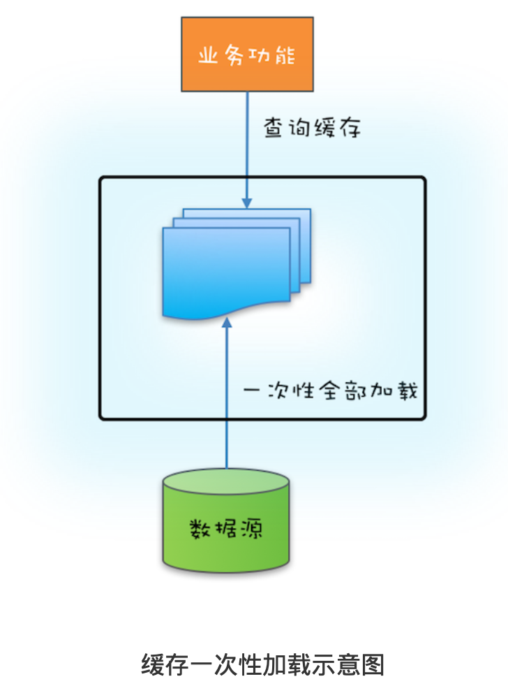
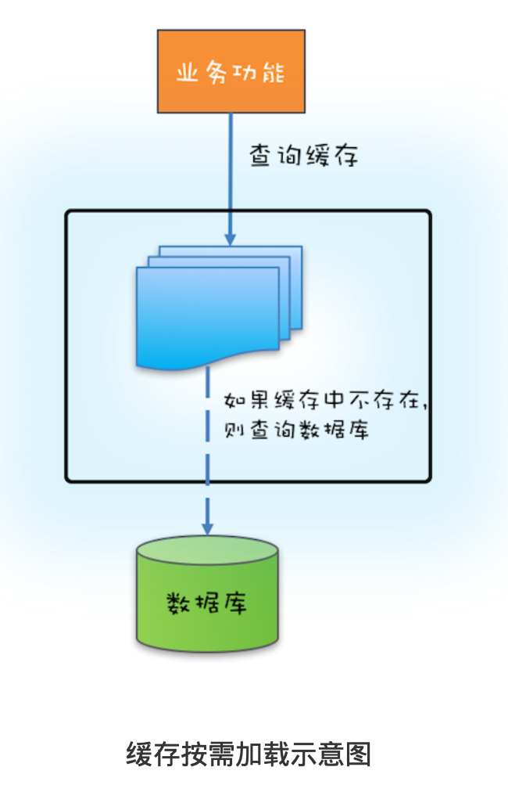

# 17 | ReadWriteLock:如何快速实现一个完备的缓存?

# 背景
前面介绍了管程和信号量这两个同步原语在 Java 语言中的实现，理论上这两个任何一个都能解决所有的并发问题。
那Java SDK 并发包里为什么还有很多其他的工具类呢？原因很简单：【分场景优化性能，提升易用性】

今天我们就介绍一种非常普遍的并发场景:读多写少场景：      
> 实际工作中，为了优化性能我们经 常会使用缓存，缓存之所以能提升性能，一个重要的条件就是缓存的数据一定是读多写少的，例如元数据和基础数据 基本上不会发生变化(写少)，但是使用它们的地方却很多(读多)。

针对读多写少这种场景，java SDK并发包提供了一个readWriteLock读写锁，容易使用并且性能好！

# what？什么是读写锁？
读写锁，并不是 Java 语言特有的，而是一个广为使用的通用技术，所有的读写锁都遵守以下三条 基本原则:        
- 1.允许多个线程同时读共享变量;
- 2.只允许一个线程写共享变量;
- 3.如果一个写线程正在执行写操作，此时禁止读线程读共享变量。

读写锁与互斥锁的一个重要区别就是：【读写锁允许多个线程同时读共享变量】，而互斥锁是不允许 的，这是读写锁在读多写少场景下性能优于互斥锁的关键。     
但【读写锁的写操作是互斥的，当一个 线程在写共享变量的时候，是不允许其他线程执行写操作和读操作】。

# 快速实现一个缓存
如下例子：缓存的内部是用1个hashMap来保存数据，由于hashMap不是线程安全的，因此我们用readWriteLock来保证线程安全！
readWriteLock的实现类是ReentrantReadWriteLock。       
这样看来，读 写锁的使用还是非常简单的。
```java
/**
 * @Author gaoqiangwei
 * @Date 2020/6/9 23:06
 * @Description
 */
public class Cache<K,V> {

    final Map<K,V> map = new HashMap<>();

    private ReadWriteLock rwl = new ReentrantReadWriteLock();
    //读锁
    Lock readLock = rwl.readLock();
    //写锁
    Lock writeLock = rwl.writeLock();

    private V get(K k) {
        readLock.lock();
        try {
            return map.get(k);
        }finally {
            readLock.unlock();
        }
    }

    private V set(K key, V v) {
        writeLock.lock();
        try {
            return map.put(key, v);
        }finally {
            writeLock.unlock();
        }
    }
    
}
```


使用缓存首先要解决缓存数据的初始化问题。缓存数据 的初始化，可以采用一次性加载的方式，也可以使用按需加载的方式。        

- 如果源头数据的数据量不大，就可以采用一次性加载的方式，如下：


果源头数据量非常大，那么就需要按需加载了，按需加载也叫懒加载，指的是只有当应用查询 缓存，并且数据不在缓存里的时候，才触发加载源头相关数据进缓存的操作。        

如何实现缓存按需加载？     
如果缓存中没有缓存目标对象，那么就需要从数据库中加载，然后写入缓存，写缓存需要用 到写锁，所以在代码中的5处，我们调用了 w.lock()
来获取写锁：      
```java
class Cache1<K, V>{

    final Map<K,V> map = new HashMap<>();

    private ReadWriteLock rwl = new ReentrantReadWriteLock();
    //读锁
    final Lock readLock = rwl.readLock();
    //写锁
    final Lock writeLock = rwl.writeLock();

    V get(K key) {
        V v = null;
        readLock.lock();//1
        try {
            v = map.get(key);//2
        }finally {
            readLock.unlock();//3
        }
        if (v != null) {//4
            return v;
        }

        writeLock.lock();//5
        try {
            v = map.get(key);//6
            if (v == null) {//7
                //查询数据库，省略无数代码。。。
                //v =  select xxx from table where id = xxx;
                map.put(key, v);
            }
            return v;
        }finally {
            writeLock.unlock();
        }
    }
}
```
【注意】在获取写锁之后，我们并没有直接去查询数据库，而是在代码67处， 重新验证了一次缓存中是否存在，再次验证如果还是不存在，我们才去查询数据库并更新本地缓 存。为什么我们要再次验证呢?       

【原因】高并发场景下，假设T1 T2 T3参数相同，同时获取读锁后都没有读到数据，等到达6处时只能有一个假设T1获取到写锁并且进行执行，
如果不在此判断缓存map是否有值时，假设T1从DB查出来写到map里，那么T2进来，如果没有67处代码，那么T2会重新
去DB查然后写到put，同意T2执行完后T3进来，如果没有67处代码，那么它也会继续查库写put，所以T2 T3完全没必要        


# 读写锁的升级与降级
在1处获取读锁，在3处释放读锁，那是否可以在2处的下面增加 验证缓存并更新缓存的逻辑呢?详细的代码如下。
```text
V v = null;
readLock.lock();//1
try {
    v = map.get(key);//2
    if (v == null) {
        writeLock.lock();
        try{
            //查数据库
        }finally{
            writeLock.unlock();
        }
    }
}finally {
    readLock.unlock();//3
}
```
这样看上去好像是没有问题的，先是获取读锁，然后再升级为写锁，对此还有个专业的名字，叫
锁的升级。可惜 ReadWriteLock 并不支持这种升级。
在上面的代码示例中，【读锁还没有释放，此 时获取写锁，会导致写锁永久等待】，
最终导致相关线程都被阻塞，永远也没有机会被唤醒。锁的 升级是不允许的，这个你一定要注意。

不过，虽然锁的升级是不允许的，但是锁的降级却是允许的。
以下代码来源自 ReentrantReadWriteLock 的官方示例，略做了改动。
你会发现在代码1处，获取读锁的时候线程 还是持有写锁的，这种锁的降级是支持的。
```text
1class CachedData {
2  Object data;
3  volatile boolean cacheValid;
4  final ReadWriteLock rwl =
5    new ReentrantReadWriteLock();
6  //读锁
final Lock r = rwl.readLock();
8  //写锁
9 final Lock w = rwl.writeLock();
10
11 void processCachedData() {
12 //
13 r.lock();
14 if (!cacheValid) {
15 //
16 r.unlock();
17 //
18 w.lock();
19 try {
20
21
22
23
24
25
26
27
28 } 29
//
if (!cacheValid) {
data = ...
  cacheValid = true;
}
//
// r.lock(); finally { // w.unlock();
30
31 }
32 }
33 //
34 try
35 finally {r.unlock();}
36 }
day37 }

```

# 总结

读写锁类似于 ReentrantLock，也支持公平模式和非公平模式。读锁和写锁都实现了 java.util.concurrent.locks.Lock 接口，
所以除了支持 lock() 方法外，tryLock()、 lockInterruptibly() 等方法也都是支持的。     
【but】        
但是有一点需要注意，那就是只有写锁支持条件变量， 读锁是不支持条件变量的，读锁调用 newCondition() 会抛出 UnsupportedOperationException 异常。


今天我们用 ReadWriteLock 实现了一个简单的缓存，这个缓存虽然解决了缓存的初始化问题，但 是没有解决缓存数据与源头数据的同步问题，     
当然可以在源头数据发生变化时，快速反馈给缓存，但这个就要依赖具体的场景了：       
- MySQL 作为数据源头，可以通过近实时地解析 binlog 来识别数据是否发生了变化，如果发生了 变化就将最新的数据推送给缓存。
- 另外，还有一些方案采取的是数据库和缓存的双写方案。
总之，具体采用哪种方案，还是要看应用的场景。

# 课后        
有同学反映线上系统停止响应了，CPU 利用率很低，你怀疑有同学一不小心写出了读锁升级写锁 的方案，那你该如何验证自己的怀疑呢?


