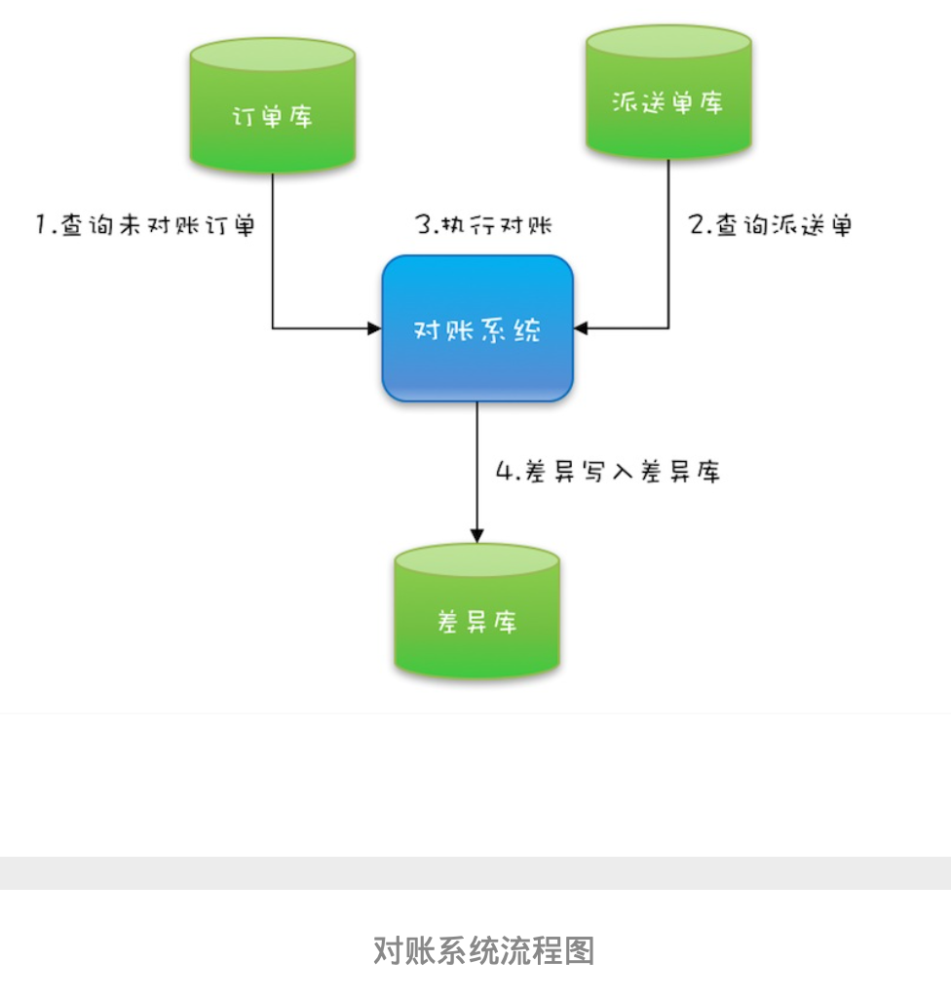
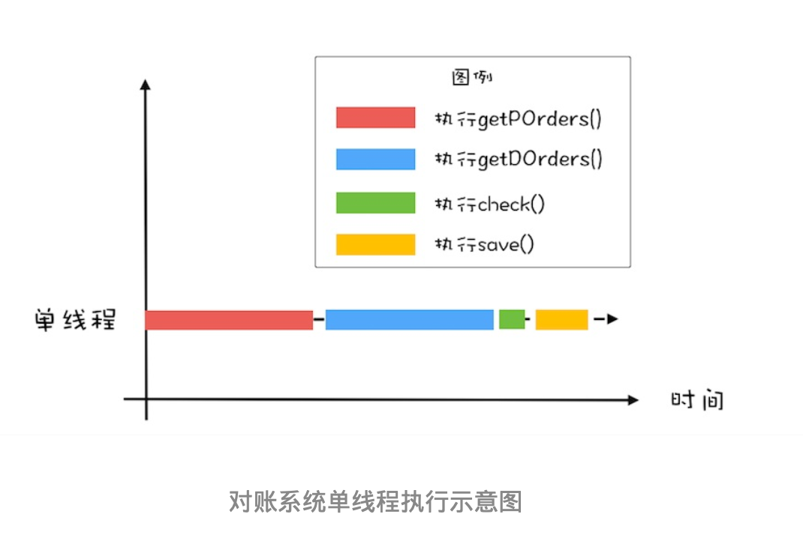
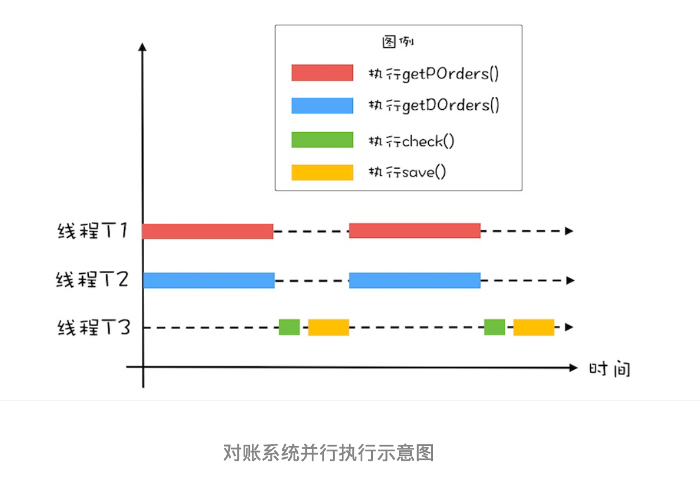
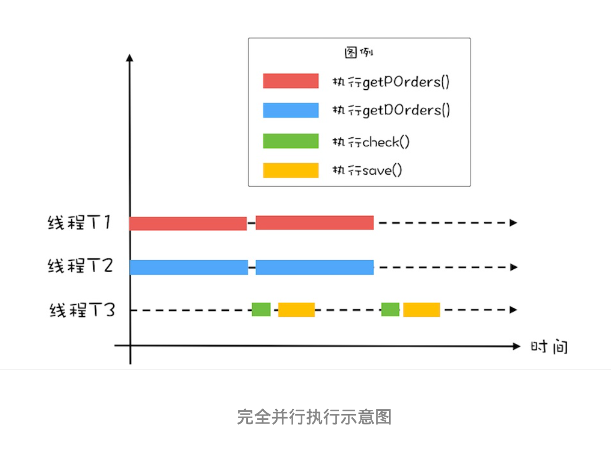
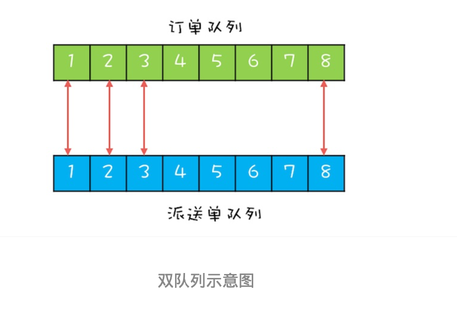
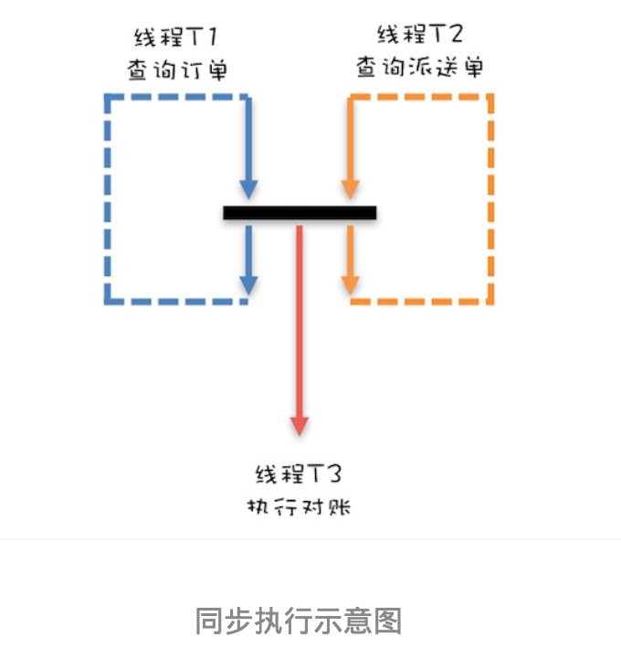

# 19 | CountDownLatch和CyclicBarrier:如何让多线程 步调一致?

# 背景
前几天老板突然匆匆忙忙过来，说对账系统最近越来越慢了，能不能快速优化一下。我了解了对 账系统的业务后，发现还是挺简单的:
- 用户通过在线商城下单，会生成电子订单，保存在订单 库;
- 之后物流会生成派送单给用户发货，派送单保存在派送单库。
- 为了防止漏派送或者重复派 送，对账系统每天还会校验是否存在异常订单。
处理逻辑总结一句就是：首 先查询订单，然后查询派送单，之后对比订单和派送单，将差异写入差异库。


对账系统的代码抽象之后，也很简单，核心代码如下，就是在一个单线程里面循环查询订单、派 送单，然后执行对账，最后将写入差异库。
```text
while(存在未对账订单) {
    //查询未对账订单
    pos = getPOrders();
    //查询未对账派送单
    dos = getDOrders();
    //执行对账操作
    diff = check(pos, dos);
    //差异写入对账库
    save(diff);
}
```

# 利用并行优化对账系统
老板要我优化性能，那我就首先要找到这个对账系统的瓶颈所在。       

目前的对账系统，由于订单量和派送单量巨大，所以查询未对账订单 getPOrders() 和查询派送单 getDOrders() 相对较慢，那有没有办法快速优化一下呢?目前对账系统是单线程执行的，图形化 后是下图这个样子。      
【对于串行化的系统，优化性能首先想到的是能否利用多线程并行处理。】



所以，这里你应该能够看出来这个对账系统里的瓶颈:查询未对账订单 getPOrders() 和查询派送 单 getDOrders() 是否可以并行处理呢?显然是可以的，因为这两个操作并没有先后顺序的依赖。 
这两个最耗时的操作并行之后，执行过程如下图所示。对比一下单线程的执行示意图，你会发现 同等时间里，并行执行的吞吐量近乎单线程的 2 倍，优化效果还是相对明显的。


思路有了，下面我们再来看看如何用代码实现:       
      
（1）在下面的代码中，我们创建了两个线程 T1 和 T2，并行执行查询未对账订单 getPOrders() 和查询派送单 getDOrders() 这两个操作。在主线程 中执行对账操作 check() 和差异写入 save() 两个操作。        
（2）不过需要注意的是:主线程需要等待线程 T1 和 T2 执行完才能执行 check() 和 save() 这两个操作，为此我们通过调用 T1.join() 和 T2.join() 来实现等待，当 T1 和 T2 线程退出时，调用 T1.join() 和 T2.join() 的主线程就会从阻塞态被唤醒， 从而执行之后的 check() 和 save()。

```text
/**
 * @Author gaoqiangwei
 * @Date 2020/6/10 23:18
 * @Description
 */
public class TestDiff {
    public static void main(String[] args)throws Exception {
        while (存在未对账订单) {
            Thread t1 = new Thread( () -> {
                //查询未对账订单
            });
            t1.start();
            Thread t2 = new Thread( () -> {
                //查询未派送订单
            });
            t2.start();
            
            t1.join();
            t2.join();
            diff = check(xxx, xxx);
            save(diff);
        }
    }
}
```

# 用 CountDownLatch 实现线程等待
【完美了吗？】     
经过上面的优化之后，基本上可以跟老板汇报收工了，但还是有点美中不足，相信你也发现了， while 循环里面每次都会创建新的线程，而创建线程可是个耗时的操作。所以最好是创建出来的 线程能够循环利用，估计这时你已经想到线程池了，是的，线程池就能解决这个问题。

【好问题】       
而下面的代码就是用线程池优化后的:我们首先创建了一个固定大小为 2 的线程池，之后在 while 循环里重复利用。一切看上去都很顺利，但是有个问题好像无解了，那就是主线程如何知 道 getPOrders() 和 getDOrders() 这两个操作什么时候执行完呢？      

【为毛？】       
前面主线程通过调用线程 T1 和 T2的 join方法来等待线程 T1 和 T2 退出，但是在线程池的方案里，线程根本就不会退出，所以 join() 方法已经失效了。

```text
/**
 * @Author gaoqiangwei
 * @Date 2020/6/10 23:18
 * @Description
 */
public class TestDiff {
    public static void main(String[] args)throws Exception {
        while (存在未对账订单) {
            Thread t1 = new Thread( () -> {
                //查询未对账订单
            });
            t1.start();
            Thread t2 = new Thread( () -> {
                //查询未派送订单
            });
            t2.start();

            t1.join();
            t2.join();
            diff = check(xxx, xxx);
            save(diff);
        }
    }

    public static  void diffByPool() {
        ExecutorService es = Executors.newFixedThreadPool(2);
        while (//存在未对账订单) {
            es.execute(() -> {
                //查询未对账订单
            });
            es.execute(() -> {
                //查询未派送订单
            });
            /* ??如何实现等待??*/
            diff = check(xxx, xxx);
            save(diff);
        }
    }
}
```

如何解决这个问题呢？
最简单的个办法：弄一个计数器，初始值是2，查询订单后减1，查询派送单后减1，主线程等减到0就可以继续执行了。       
等待计数器等于 0 其实就是一个条件变量，用管程实现起来也很简单。

不过，实际中并不希望你这样搞，因为java sdk已经提供了这样的个类：【countDownLatch（主角出场）】，我们直接使用就可以了。
示例代码如下：     
- 在 while 循环里 面，我们首先创建了一个CountDownLatch，计数器的初始值等于2
- 之后在pos = getPOrders();和dos = getDOrders(); 两条语句的后面对计数器执行减1操作，这个对计数器减1的操作 是通过调用latch.countDown(); 

在主线程中，我们通过调用latch.await() 来实现对计数器等于 0 的等待。      
```text
    public static void diffByCountDownLatch()throws Exception {
        CountDownLatch cdl = new CountDownLatch(2);
        ExecutorService es = Executors.newFixedThreadPool(2);
        while(存在未对账订单) {
            es.execute(() -> {
                //查询未对账订单
                cdl.countDown();
            });
            es.execute(() -> {
                //查询未派送订单
                cdl.countDown();
            });
            cdl.await();
            diff = check(xxx, xxx);
            save(diff);
        }
    }
```

# 进一步优化性能
经过上面重重优化后似乎很满意了，那还有优化空间吗？有的！        

前面我们将 getPOrders() 和 getDOrders() 这两个查询操作并行了，但这两个查询操作和对账操 作 check()、save() 之间还是串行的。     

很显然，这两个查询操作和对账操作也是可以并行的，也就 是说，在执行对账操作的时候，可以同时去执行下一轮的查询操作，这个过程可以形象化地表述 为下面这幅示意图。


接下来分析如何优化呢？
- 显然，两步查询操作和对账操作是可以并行的，对账操作还 依赖查询操作的结果，这明显有点生产者 - 消费者的意思。
- 两次查询操作是生产者，对账操作是 消费者。既然是生产者 - 消费者模型，那就需要有个队列，来保存生产者生产的数据，而消费者 则从这个队列消费数据。


不过针对对账这个项目，我设计了两个队列，并且两个队列的元素之间还有对应关系。
具体如下 图所示，订单查询操作将订单查询结果插入订单队列，派送单查询操作将派送单插入派送单队 列，
这两个队列的元素之间是有一一对应的关系的。两个队列的好处是，对账操作可以每次从订 单队列出一个元素，
从派送单队列出一个元素，然后对这两个元素执行对账操作，这样数据一定 不会乱掉。


下面再来看如何用双队列来实现完全的并行。一个最直接的想法是:      
【模型】一个线程 T1 执行订单的查 询工作，一个线程 T2 执行派送单的查询工作，当线程 T1 和 T2 都各自生产完 1 条数据的时候， 通知线程 T3 执行对账操作。

这个想法虽看上去简单，但其实还隐藏着一个条件，那就是线程 T1 和线程 T2 的工作要步调一致，不能一个跑得太快，一个跑得太慢，只有这样才能做到各自生产 完 1 条数据的时候，通知线程 T3。        


下面这幅图形象地描述了上面的意图:线程 T1 和线程 T2 只有都生产完 1 条数据的时候，才能一 起向下执行，也就是说，线程 T1 和线程 T2 要互相等待，步调要一致;同时当线程 T1 和 T2 都生 产完一条数据的时候，还要能够通知线程 T3 执行对账操作。


## 用 CyclicBarrier 实现线程同步
下面我们就来实现上面提到的方案。这个方案的难点有两个:一个是线程 T1 和 T2 要做到步调一 致，另一个是要能够通知到线程 T3。

你依然可以利用一个计数器来解决这两个难点，计数器初始化为 2，线程 T1 和 T2 生产完一条数 据都将计数器减 1，如果计数器大于 0 则线程 T1 或者 T2 等待。
如果计数器等于 0，则通知线程 T3，并唤醒等待的线程 T1 或者 T2，与此同时，将计数器重置为 2，这样线程 T1 和线程 T2 生产 下一条数据的时候就可以继续使用这个计数器了。

同样，还是建议你不要在实际项目中这么做，因为 Java 并发包里也已经提供了相关的工具 类:【CyclicBarrier】。
在下面的代码中，我们首先创建了一个计数器初始值为 2 的 CyclicBarrier， 你需要注意的是创建 CyclicBarrier 的时候，我们还传入了一个回调函数，当计数器减到 0 的时候，会回调这个函数       
- 线程 T1 负责查询订单，当查出一条时，调用 barrier.await()来将计数器减 1，同时等待计数器变成 0;
- 线程 T2 负责查询派送单，当查出一条时，也调用 barrier.await() 来将计数器减1，同时等待计数器变成0;
- 当T1和T2都调用 barrier.await() 的时候，计数器会减到0，此时T1和T2就可以执行下一条语句了，同时 会调用 barrier 的回调函数来执行对账操作。

> 非常值得一提的是，CyclicBarrier 的计数器有自动重置的功能，当减到 0 的时候，会自动重置你 设置的初始值。这个功能用起来实在是太方便了。

```text
/**
 * @Author gaoqiangwei
 * @Date 2020/6/10 23:52
 * @Description
 */
public class TestCyclicBarrier {
    //订单队列
    Vector<P> pos;
    //派送单队列
    Vector<D> dos;

    Executor executors = Executors.newFixedThreadPool(1);

    final CyclicBarrier barrier = new CyclicBarrier(2,()-> {
        executors.execute(() -> check());
    });

    void check() {
        P p = pos.remove(0);
        D d = dos.remove(0);
        diff = check(xxx, xxx);
        save(diff);
    }

    void checkAll() {
        // 循环查询订单库
        Thread t1 = new Thread(() -> {
            while(存在未对账订单) {
                // 查询订单库
                pos.add(getPOrders());
                // 等待
                barrier.await();
            }
        });
        t1.start();
        Thread t2 = new Thread(() -> {
            while(存在未派送订单) {
                // 查询订单库
                pos.add(getPDos());
                // 等待
                barrier.await();
            }
        });
        t2.start();
    }
}
```

# 总结        
CountDownLatch 和 CyclicBarrier 是 Java 并发包提供的两个非常易用的线程同步工具类，这两个 工具类用法的区别在这里还是有必要再强调一下:       
- 【CountDownLatch 主要用来解决一个线程等待 多个线程的场景】，可以类比旅游团团长要等待所有的游客到齐才能去下一个景点;
- 而 【CyclicBarrier 是一组线程之间互相等待】，更像是几个驴友之间不离不弃。        

除此之外 CountDownLatch 的计数器是不能循环利用的，也就是说一旦计数器减到 0，再有线程调用 await()，该线程会直接通过。
但CyclicBarrier 的计数器是可以循环利用的，而且具备自动重置的 功能，一旦计数器减到 0 会自动重置到你设置的初始值。除此之外，CyclicBarrier 还可以设置回 调函数，可以说是功能丰富。        

# 课后思考
最后的示例代码中，CyclicBarrier的回调函数我们设置1个线程数的线程池，你觉得是否有必要呢？


