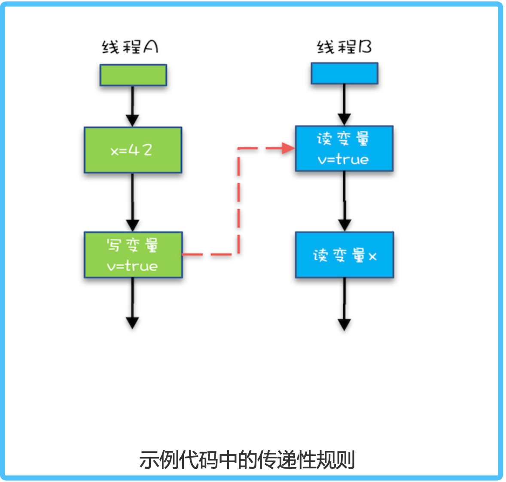

# 背景
> 你已经知道，导致可见性的原因是缓存，导致有序性的原因是编译优化，那解决可见性、 有序性最直接的办法就是禁用缓存和编译优化，但是这样问题虽然解决了，我们程序的性 能可就堪忧了。
 合理的方案应该是按需禁用缓存以及编译优化。

# 什么是Java内存模型
> Java 内存模型,本质上可以理解为，Java 内存模型规范了 JVM 如何提供按需禁用缓存和编译优化的 方法。
>> 具体来说，这些方法包括volatile、synchronized、final和6大Happens-Before原则

# 使用 volatile 的困惑
描述：     
volatile 关键字并不是 Java 语言的特产，古老的 C 语言里也有，它最原始的意义就是禁用 CPU 缓存。
例如，我们声明一个 volatile 变量 volatile int x = 0，它表达的是:告诉编译器， 对这个变量的读写，不能使用 CPU 缓存，
必须从内存中读取或者写入。这个语义看上去相 当明确，但是在实际使用的时候却会带来困惑。

举例：     
下面的示例代码，假设线程 A 执行 writer() 方法，按照 volatile 语义，会把变量 “v=true” 写入内存;
假设线程 B 执行 reader() 方法，同样按照 volatile 语义，线程 B 会从内存中读取变量 v，如果线程 B 看到 “v == true” 时，
那么线程 B 看到的变量 x 是 多少呢?
直觉上看，应该是 42，那实际应该是多少呢?这个要看 Java 的版本，如果在低于 1.5 版 本上运行，x 可能是 42，也有可能是 0;如果在 1.5 以上的版本上运行，x 就是等于 42。
```java
class VolatileExample {
    int x = 0;
    volatile boolean v = false;
    public void write() {
        x = 42;
        v = true;
    }
    public void reader() {
        if (v) {
            //这里x是多少呢？
        }
    }
}
```

分析：     
为什么 1.5 以前的版本会出现 x = 0 的情况呢?我相信你一定想到了，变量 x 可能被 CPU 缓存而导致可见性问题。
这个问题在 1.5 版本已经被圆满解决了。Java 内存 模型在 1.5 版本对 volatile 语义进行了增强。怎么增强的呢?
答案就是一项 Happens- Before 规则


#Happens-before原则
- 1、它真正要表达的是:前面一个操作的结果对后续操作是可见的。        
- 2、比较正式的说法是:Happens-Before 约束 了编译器的优化行为，虽允许编译器优化，但是要求编译器优化后一定遵守 Happens- Before 规则。


## 1、程序的顺序性规则       
 这条规则是指在一个线程中，按照程序顺序，前面的操作 Happens-Before 于后续的任意 操作。        
 这还是比较容易理解的，比如刚才那段示例代码，按照程序的顺序，第 6 行代码
 “x = 42;” Happens-Before 于第 7 行代码 “v = true;”，这就是规则 1 的内容，
 也比 较符合单线程里面的思维:程序前面对某个变量的修改一定是对后续操作可见的。(代码再贴一遍)
```java
class VolatileExample {
    int x = 0;
    volatile boolean v = false;
    public void write() {
        x = 42;
        v = true;
    }
    public void reader() {
        if (v) {
            //这里x是多少呢？
        }
    }
}
```

## 2、volatile 变量规则
这条规则是指对一个 volatile 变量的写操作， Happens-Before 于后续对这个 volatile
变量的读操作。
> 这个就有点费解了，对一个 volatile 变量的写操作相对于后续对这个 volatile 变量的读操 作可见，
>这怎么看都是禁用缓存的意思啊，貌似和 1.5 版本以前的语义没有变化啊?如果 单看这个规则，的确是这样，
>但是如果我们关联一下规则 3，就有点不一样的感觉了。


## 3、传递性        
这条规则是指：如果 A Happens-Before B，且 B Happens-Before C，那么 A Happens-
Before C。       

我们将规则 3 的传递性应用到我们的例子中，会发生什么呢?可以看下面这幅图:
       
从图中，我们可以看到:     
- 1.“x=42” Happens-Before 写变量 “v=true” ，这是规则 1 的内容;
- 2.写变量“v=true” Happens-Before 读变量 “v=true”，这是规则 2 的内容 。
- 3.再根据这个传递性规则，我们得到结果:“x=42” Happens-Before 读变 量“v=true”。这意味着什么呢?
> 如果线程 B 读到了“v=true”，那么线程 A 设置的“x=42”对线程 B 是可见的。也就是 说，线程 B 能看到 “x == 42” ，有没有一种恍然大悟的感觉?这就是 1.5 版本对 volatile 语义的增强，这个增强意义重大，1.5 版本的并发工具包(java.util.concurrent) 就是靠 volatile 语义来搞定可见性的，这个在后面的内容中会详细介绍。

## 4、管程中锁的规则        
这条规则是指对一个锁的解锁 Happens-Before 于后续对这个锁的加锁。        

要理解这个规则，就首先要了解“管程指的是什么”。管程是一种通用的同步原语，在 Java 中指的就是 synchronized，synchronized 是 Java 里对管程的实现。     

管程中的锁在 Java 里是隐式实现的，例如下面的代码，在进入同步块之前，会自动加锁， 而在代码块执行完会自动释放锁，加锁以及释放锁都是编译器帮我们实现的。
```
class DemoClass {
    private static int x = 10;
    public void test() {
        synchronized (this) {
            //x是共享变量，初始值是10
            if (this.x < 12) {
                this.x = 12;
            }
        }//此处自动解锁
    }
}
```
> 所以结合规则 4管程中锁的规则，可以这样理解:假设 x 的初始值是 10，线程 A 执 行完代码块后 x 的值会变成 12(执行完自动释放锁)，
线程 B 进入代码块时，能够看到 线程 A 对 x 的写操作，也就是线程 B 能够看到 x==12。这个也是符合我们直觉的，应该 不难理解。

## 5、线程 start() 规则      
> 这条是关于线程启动的。它是指主线程 A 启动子线程 B 后，子线程 B 能够看到主线程在
  启动子线程 B 前的操作。

换句话说就是，如果线程 A 调用线程 B 的 start() 方法(即在线程 A 中启动线程 B)，那 么该 start() 操作 Happens-Before 于线程 B 中的任意操作。具体可参考下面示例代码。
```java
public class Test01 {
    public static void main(String[] args) {
        Thread B = new Thread( () -> {
            //主线程调用 B.start() 之前,所有对共享变量的修改，此处皆可见,此例中，var==77
        });
        // 此处对共享变量 var 修改 var = 77;
        int var = 77;
        //主线程启动子线程
        B.start();
    }
}
```

## 6、线程 join() 规则       
这条是关于线程等待的。     
它是指主线程 A 等待子线程 B 完成(主线程 A 通过调用子线程 B 的 join() 方法实现)，当子线程 B 完成后(主线程 A 中 join() 方法返回)，主线程能
 复制代码
够看到子线程的操作。当然所谓的“看到”，指的是对共享变量的操作。        

换句话说就是，如果在线程 A 中，调用线程 B 的 join() 并成功返回，那么线程 B 中的任
意操作 Happens-Before 于该 join() 操作的返回。具体可参考下面示例代码。     
```text
1 Thread B = new Thread(()->{
2 // 此处对共享变量 var 修改
3 var = 66;
4 });
5 // 例如此处对共享变量修改，
6 // 则这个修改结果对线程 B 可见
7 // 主线程启动子线程
8 B.start();
9 B.join()
10 // 子线程所有对共享变量的修改
11 // 在主线程调用 B.join() 之后皆可见
12 // 此例中，var==66
```

## 被我们忽视的 final     
> 前面我们讲 volatile 为的是禁用缓存以及编译优化，我们再从另外一个方面来看，有没有
  办法告诉编译器优化得更好一点呢?这个可以有，就是final 关键字。        

final 修饰变量时，初衷是告诉编译器:这个变量生而不变，可以可劲儿优化。
(Java 编译器在 1.5 以前的版本的确优化得很努力，以至于都优化错了。)
> 问题类似于上一期提到的利用双重检查方法创建单例，构造函数的错误重排导致线程可能
 看到 final 变量的值会变化。(见上一章)

当然了，在 1.5 以后 Java 内存模型对 final 类型变量的重排进行了约束。现在只要我们提
供正确构造函数没有“逸出”，就不会出问题了。

“逸出”有点抽象，我们还是举个例子吧，在下面例子中，在构造函数里面将 this 赋值给 了全局变量 global.obj，这就是“逸出”，线程通过 global.obj 读取 x 是有可能读到 0 的。因此我们一定要避免“逸出”。
```text
// 以下代码来源于【参考 1】 
final int x;
// 错误的构造函数
public FinalFieldExample() {
    x=3;
    y=4;
    // 此处就是讲 this 逸出， 
    global.obj = this;
}
```


# 总结        
在某论文中提出，Happens-Before 的语义是一种因果关系。
在现实世界里，如果 A 事件是导致 B 事件的起因，那么 A 事件 一定是先于(Happens-Before)B 事件发生的，
这个就是 Happens-Before 语义的现实 理解。

在 Java 语言里面，Happens-Before 的语义本质上是一种可见性，
A Happens-Before B 意味着 A 事件对 B 事件来说是可见的，
无论 A 事件和 B 事件是否发生在同一个线程里。 例如 A 事件发生在线程 1 上，B 事件发生在线程 2 上，
Happens-Before 规则保证线程 2 上也能看到 A 事件的发生。

# 课后思考
有一个共享变量 abc，在一个线程里设置了 abc 的值 abc=3，你思考一下，有哪些办法可 以让其他线程能够看到abc==3?

