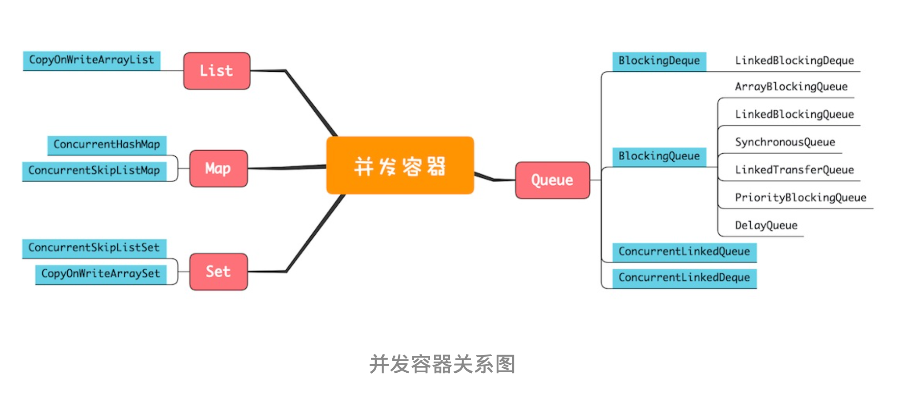
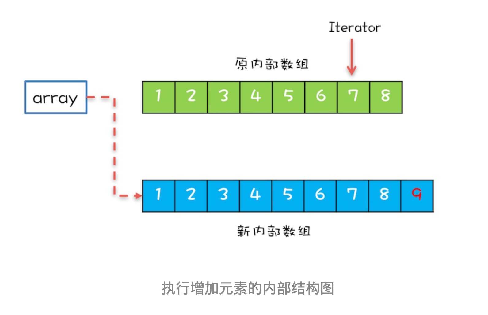

# 20 | 并发容器:都有哪些“坑”需要我们填?

# 背景
Java 1.5 之前提供的同步容器虽然也能保证线程安全，但是性能很差,
而 Java 1.5 版本之后提供 的并发容器在性能方面则做了很多优化，并且容器的类型也更加丰富了。

# 同步容器及其注意事项
Java 中的容器主要可以分为四个大类，分别是 List、Map、Set 和 Queue，但并不是所有的 Java 容器都是线程安全的。
例如arrayList和hashMap就不是线程安全的。        
那么如何将容器变成线程安全的呢？前面12章里讲过思路其实很简单，只需要把非线 程安全的容器封装在对象内部，然后控制好访问路径就可以了。
下面我们就以 ArrayList 为例，看看如何将它变成线程安全的。
```text
/**
 * @Author gaoqiangwei
 * @Date 2020/6/11 07:15
 * @Description
 */
public class SafeArrayList<T> {
    Vector v;
    ArrayList<T> c = new ArrayList();

    // 控制访问路径

    public synchronized T get(int idx) {
        return c.get(idx);
    }

    public synchronized void add(int idx, T t) {
        c.add(idx, t);
    }

    public synchronized boolean addIfNotExit(T t) {
        if (!c.contains(t)) {
            c.add(t);
            return true;
        }
        return false;
    }
}
```
如上：所有访问 c 的方法我们都增加了 synchronized 关键字

看到这里，你可能会举一反三，然后想到:所有非线程安全的类是不是都可以用这种包装的方式 来实现线程安全呢?
其实这一点不止你想到了，Java SDK 的开发人员也想到了，
所以他们在 Collections 这个类中还提供了一套完备的包装类，比如下面的示例代码中，
分别把 ArrayList、 HashSet 和 HashMap 包装成了线程安全的 List、Set 和 Map。
```text
class CollectTest {
    List safeArray = Collections.synchronizedList(new ArrayList<>());
    Set safeSet = Collections.synchronizedSet(new HashSet<>());
    Map safeMap = Collections.synchronizedMap(new HashMap<>());
}
```
我们曾经多次强调，【组合操作需要注意竞态条件问题】，例如上面提到的 addIfNotExist() 方法就包 含组合操作。
组合操作往往隐藏着竞态条件问题，即便每个操作都能保证原子性，也并不能保证 组合操作的原子性，这个一定要注意。

在容器领域一个容易被忽视的“坑”是用迭代器遍历容器，例如在下面的代码中，通过迭代器遍 历容器 list，对每个元素调用 foo() 方法，这就存在并发问题，这些组合的操作不具备原子性。        

```text
List safeList = Collectors.Synchronized(new ArrayList());
Iterator i = safeList.iteritor();
while(i.hasNext()) {
    foo(i.next());
}
```

而正确做法是下面这样，锁住 list 之后再执行遍历操作。如果你查看 Collections 内部的包装类源 码，
你会发现包装类的公共方法锁的是对象的 this，其实就是我们这里的 list，所以锁住 list 绝对 是线程安全的。
```text
List safeList = Collectors.Synchronized(new ArrayList());

Synchronized(safeList) {
while(i.hasNext()) {
    Iterator i = safeList.iteritor();
    foo(i.next());
}
}
```
面我们提到的这些经过包装后线程安全容器，都是基于 synchronized 这个同步关键字实现的， 所以也被称为同步容器。
Java 提供的同步容器还有 Vector、Stack 和 Hashtable，这三个容器不 是基于包装类实现的，但同样是基于 synchronized 实现的，对这三个容器的遍历，同样要加锁保 证互斥。

# 并发容器及其注意事项      
Java 在 1.5 版本之前所谓的线程安全的容器，主要指的就是【同步容器】。不过同步容器有个最大的 问题，那就是性能差，所有方法都用 synchronized 来保证互斥，串行度太高了。
因此 Java 在 1.5 及之后版本提供了性能更高的容器，我们一般称为【并发容器】。

并发容器虽然数量非常多，但依然是前面我们提到的四大类:List、Map、Set 和 Queue，下面的 并发容器关系图，基本上把我们经常用的容器都覆盖到了。



鉴于并发容器的数量太多，只介绍关键点

## (一)List
List 里面只有一个实现类就是CopyOnWriteArrayList。CopyOnWrite，顾名思义就是写的时候会
将共享变量新复制一份出来，这样做的好处是【读操作完全无锁】。

那 CopyOnWriteArrayList 的实现原理是怎样的呢?下面我们就来简单介绍一下

CopyOnWriteArrayList 内部维护了一个数组，成员变量 array 就指向这个内部数组，所有的读操 作都是基于 array 进行的，如下图所示，迭代器 Iterator 遍历的就是 array 数组。


如果在遍历 array 的同时，还有一个写操作，例如增加元素，CopyOnWriteArrayList 是如何处理 的呢?CopyOnWriteArrayList 会将 array 复制一份，然后在新复制处理的数组上执行增加元素的 操作，执行完之后再将 array 指向这个新的数组。通过下图你可以看到，读写是可以并行的，遍 历操作一直都是基于原 array 执行，而写操作则是基于新 array 进行。


(高仔提示：一句话，就是读写分离呗，哈哈哈)

使用 CopyOnWriteArrayList 需要注意的“坑”主要有两个方面:
- 一个是应用场景， CopyOnWriteArrayList 仅适用于写操作非常少的场景，而且【能够容忍读写的短暂不一致】。例如上 面的例子中，写入的新元素并不能立刻被遍历到。
- 另一个需要注意的是，CopyOnWriteArrayList 迭代器是只读的，不支持增删改。因为迭代器遍历的仅仅是一个快照，而对快照进行增删改是没 有意义的。

## (二)Map
Map 接口的两个实现是 ConcurrentHashMap 和 ConcurrentSkipListMap，
它们从应用的角度来 看，主要区别在于ConcurrentHashMap 的 key 是无序的，而 ConcurrentSkipListMap 的 key 是 有序的。
所以如果你需要保证 key 的顺序，就只能使用 ConcurrentSkipListMap。
(高仔提示：一碰到skip，说明是有序的，例如redis里的skipList跳表)

使用 ConcurrentHashMap 和 ConcurrentSkipListMap 需要注意的地方是，它们的 key 和 value 都不能为空，否则会抛出NullPointerException

上经典图：


补充：ConcurrentSkipListMap 里面的 SkipList 本身就是一种数据结构，中文一般都翻译为【“跳表”】。 跳表插入、删除、查询操作平均的时间复杂度是 O(log n)，理论上和并发线程数没有关系，所以 在并发度非常高的情况下，若你对 ConcurrentHashMap 的性能还不满意，可以尝试一下 ConcurrentSkipListMap。

### (三)Set
Set 接口的两个实现是 CopyOnWriteArraySet 和 ConcurrentSkipListSet，使用场景可以参考前面 讲述的 CopyOnWriteArrayList 和 ConcurrentSkipListMap，它们的原理都是一样的，这里就不再 赘述了。

### (四)Queue
Java 并发包里面 Queue 这类并发容器是最复杂的，你可以从以下两个维度来分类。     
- 一个维度是 阻塞与非阻塞，所谓阻塞指的是当队列已满时，入队操作阻塞;当队列已空时，出队操作阻塞。
- 另一个维度是单端与双端，单端指的是只能队尾入队，队首出队;而双端指的是队首队尾皆可入 队出队。

>科普：Java 并发包里阻塞队列都用 Blocking 关键字标识，单端队列使用 Queue 标识，双端队 列使用 Deque 标识。


这两个维度组合后，可以将 Queue 细分为四大类，分别是:

1.单端阻塞队列:(这段看的有些吃力，就通过小弟知道个延时队列)       
其实现有 ArrayBlockingQueue、LinkedBlockingQueue、 SynchronousQueue、LinkedTransferQueue、PriorityBlockingQueue 和 DelayQueue。       
内部一 般会持有一个队列，这个队列可以是数组(其实现是 ArrayBlockingQueue)也可以是链表(其实 现是 LinkedBlockingQueue);甚至还可以不持有队列(其实现是 SynchronousQueue)，此时 生产者线程的入队操作必须等待消费者线程的出队操作。
而 LinkedTransferQueue 融合 LinkedBlockingQueue 和 SynchronousQueue 的功能，性能比 LinkedBlockingQueue 更好; PriorityBlockingQueue 支持按照优先级出队;DelayQueue 支持延时出队。


2.双端阻塞队列:其实现是 LinkedBlockingDeque       


3.单端非阻塞队列:其实现是 ConcurrentLinkedQueue。

4.双端非阻塞队列:其实现是 ConcurrentLinkedDeque。

另外，使用队列时，需要格外注意队列是否支持有界(所谓有界指的是内部的队列是否有容量限 制)。实际工作中，一般都不建议使用无界的队列，因为数据量大了之后很容易导致 OOM。
上 面我们提到的这些 Queue 中，只有 ArrayBlockingQueue 和 LinkedBlockingQueue 是支持有界 的，所以在使用其他无界队列时，一定要充分考虑是否存在导致 OOM 的隐患。
(强烈建议有界)


# 总结
Java 并发容器的内容很多，实际工作中，你不单要清楚每种容器的特性，还要能选对容器，这才是关键，至于每种容器 的用法，用的时候看一下 API 说明就可以了，这些容器的使用都不难。

# 课后思考

线上系统 CPU 突然飙升，你怀疑有同学在并发场景里使用了 HashMap，因为在 1.8 之前的版本 里并发执行 HashMap.put() 可能会导致 CPU 飙升到 100%，你觉得该如何验证你的猜测呢?


