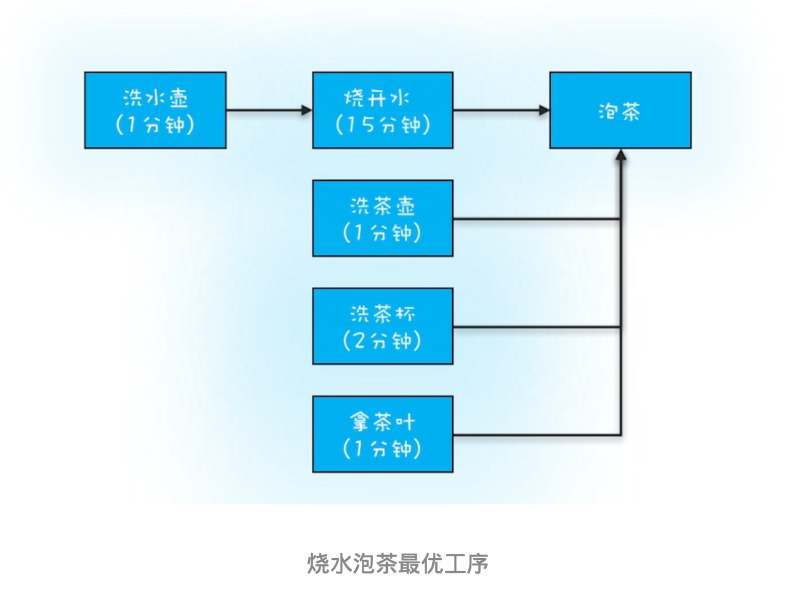
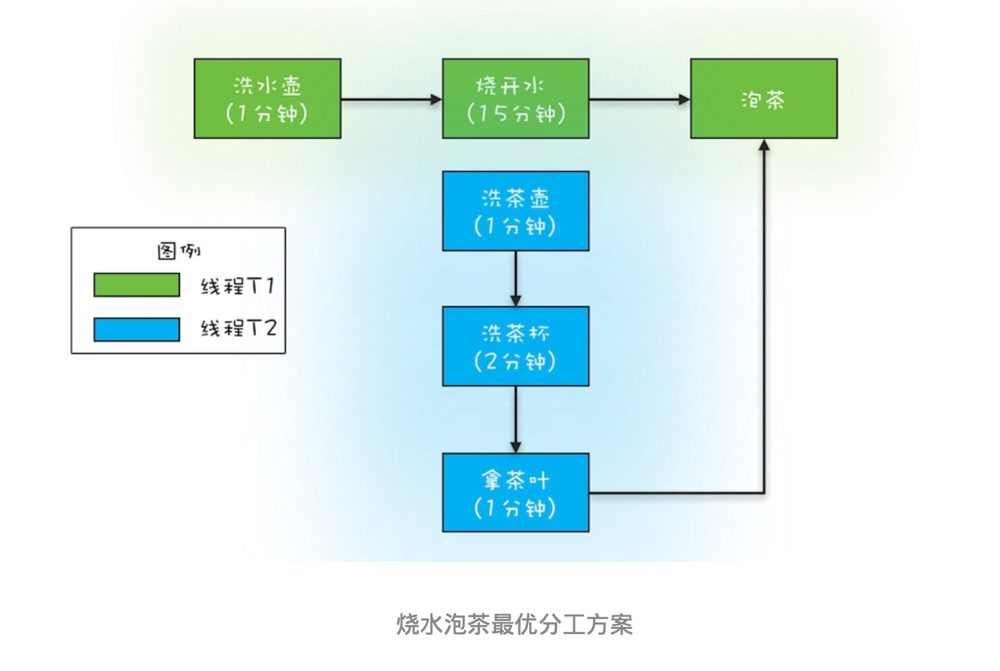

# 23-Future:如何用多线程实现最优的“烧水泡茶”程序?

# 背景
在上一篇文章中，我们仅仅介绍了ThreadPoolExecutor的 void execute(Runnable command)方法，
利用这个方法虽然可以提交任务，但是却没有办法获取任 务的执行结果(execute()方法没有返回值)。而很多场景下，我们又都是需要获取任务的执行结果的。那 ThreadPoolExecutor是否提供了相关功能呢?必须的，这么重要的功能当然需要提供了。


# 如何获取任务执行结果
Java通过ThreadPoolExecutor提供的3个submit()方法和1个FutureTask工具类来支持获得任务执行结果的需 求。下面我们先来介绍这3个submit()方法，这3个方法的方法签名如下。
```text
Future<?> submit(Runnable task);

<T> Future<T> submit(Callable<T> task);

<T> Future<T> submit(Runnable task,T result);
```

你会发现它们的返回值都是Future接口，Future接口有5个方法，我都列在下面了，它们分别是
- 取消任务的 方法cancel()
- 判断任务是否已取消的方法isCancelled()
- 判断任务是否已结束的方法isDone()
- 获得任务执行结果的get()
- 获得任务执行结果的get(timeout, unit)(支持超时机制)

通过Future接口 的这5个方法你会发现，我们提交的任务不但能够获取任务执行结果，还可以取消任务。

不过需要注意的 是:这两个get()方法都是阻塞式的，如果被调用的时候，任务还没有执行完，那么调用get()方法的线程会阻 塞，直到任务执行完才会被唤醒。


这3个submit()方法之间的区别在于方法参数不同，下面我们简要介绍一下：

1、提交Runnable任务 submit(Runnable task) :这个方法的参数是一个Runnable接口，Runnable接口的run()方法是没有返回值的，所以submit(Runnable task)这个方法返回的Future仅可以用来断
言任务已经结束了，类似于Thread.join()。

2、提交Callable任务 submit(Callable<T> task):这个方法的参数是一个Callable接口，它只有一个
call()方法，并且这个方法是有返回值的，所以这个方法返回的Future对象可以通过调用其get()方法来获取任务的执行结果。

3、提交Runnable任务及结果引用 submit(Runnable task, T result):这个方法很有意思，假设这
  个方法返回的Future对象是f，f.get()的返回值就是传给submit()方法的参数result。
  这个方法该怎么用 呢?下面这段示例代码展示了它的经典用法。需要你注意的是Runnable接口的实现类Task声明了一个有 参构造函数Task(Result r)，
  创建Task对象的时候传入了result对象，这样就能在类Task的run()方法 中对result进行各种操作了。result相当于主线程和子线程之间的桥梁，通过它主子线程可以共享数据。
  
```text
public class Test {


    public static void main(String[] args) {
        ExecutorService executor = Executors.newFixedThreadPool(2);

        Result r = new Result();

        r.setAAA(a);
        Future<T> future = executor.submit(new Task(r), r);
        Result fr = future.get();
        // 下面等式成立
        fr === r;
        fr.getAAA() === a;
        fr.getXXX() === x;
    }
}

class Task implements Runnable{

    Result r;
    Task(Result r) {
        this.r == r;
    }

    @Override
    public void run() {
        //可以操作result
         a = r.getAAA();
         r.setXXX(x);
    }
}
```
下面我们再来介绍FutureTask工具类。前面我们提到的Future是一个接口，而FutureTask是一个实实在在的 工具类，这个工具类有两个构造函数，它们的参数和前面介绍的submit()方法类似，所以这里我就不再赘述 了。

```text
FutureTask(Callable<V> callable); 
FutureTask(Runnable runnable, V result);
```

那如何使用FutureTask呢?其实很简单，FutureTask实现了Runnable和Future接口，由于实现了Runnable 接口，所以可以将FutureTask对象作为任务提交给ThreadPoolExecutor去执行，也可以直接被Thread执 行;又因为实现了Future接口，所以也能用来获得任务的执行结果。下面的示例代码是将FutureTask对象提 交给ThreadPoolExecutor去执行。
```
// 创建FutureTask
FutureTask<Integer> futureTask = new FutureTask<>(()-> 1+2); 
// 创建线程池
ExecutorService es = Executors.newCachedThreadPool(); 
// 提交
FutureTask es.submit(futureTask);
// 获取计算结果
Integer result = futureTask.get();
```

FutureTask对象直接被Thread执行的示例代码如下所示。相信你已经发现了，利用FutureTask对象可以很容 易获取子线程的执行结果。
```text
// 创建FutureTask FutureTask<Integer> futureTask
= new FutureTask<>(()-> 1+2);
// 创建并启动线程
Thread T1 = new Thread(futureTask); T1.start();
// 获取计算结果
Integer result = futureTask.get();
```

实现最优的“烧水泡茶”程序

记得以前初中语文课文里有一篇著名数学家华罗庚先生的文章《统筹方法》，这篇文章里介绍了一个烧水泡 茶的例子，文中提到最优的工序应该是下面这样:


下面我们用程序来模拟一下这个最优工序。我们专栏前面曾经提到，并发编程可以总结为三个核心问题:分 工、同步和互斥。
编写并发程序，首先要做的就是分工，所谓分工指的是如何高效地拆解任务并分配给线程。

对于烧水泡茶这个程序，一种最优的分工方案可以是下图所示的这样:用两个线程T1和T2来完成烧水 泡茶程序，T1负责洗水壶、烧开水、泡茶这三道工序，T2负责洗茶壶、洗茶杯、拿茶叶三道工序，其中T1 在执行泡茶这道工序时需要等待T2完成拿茶叶的工序。对于T1的这个等待动作，你应该可以想出很多种办 法，例如Thread.join()、CountDownLatch，甚至阻塞队列都可以解决，不过今天我们用Future特性来实 现。


下面的示例代码就是用这一章提到的Future特性来实现的。首先，我们创建了两个FutureTask——ft1和 ft2，ft1完成洗水壶、烧开水、泡茶的任务，ft2完成洗茶壶、洗茶杯、拿茶叶的任务;这里需要注意的是ft1 这个任务在执行泡茶任务前，需要等待ft2把茶叶拿来，所以ft1内部需要引用ft2，并在执行泡茶之前，调用 ft2的get()方法实现等待。
```text
// 创建任务T2的FutureTask FutureTask<String> ft2
= new FutureTask<>(new T2Task()); 
// 创建任务T1的FutureTask FutureTask<String> ft1
= new FutureTask<>(new T1Task(ft2)); 

// 线程T1执行任务ft1
Thread T1 = new Thread(ft1); T1.start();
// 线程T2执行任务ft2
Thread T2 = new Thread(ft2); T2.start();
// 等待线程T1执行结果 System.out.println(ft1.get());


// T1Task需要执行的任务:
// 洗水壶、烧开水、泡茶
class T1Task implements Callable<String>{
FutureTask<String> ft2;
// T1任务需要T2任务的FutureTask T1Task(FutureTask<String> ft2){
this.ft2 = ft2; 
}
@Override
String call() throws Exception {
System.out.println("T1:洗水壶..."); TimeUnit.SECONDS.sleep(1);
System.out.println("T1:烧开水..."); TimeUnit.SECONDS.sleep(15);
// 获取T2线程的茶叶
String tf = ft2.get(); System.out.println("T1:拿到茶叶:"+tf);
System.out.println("T1:泡茶...");
return "上茶:" + tf; }
}

// T2Task需要执行的任务:
// 洗茶壶、洗茶杯、拿茶叶
class T2Task implements Callable<String> {
    @Override
    String call() throws Exception {
System.out.println("T2:洗茶壶..."); TimeUnit.SECONDS.sleep(1);
System.out.println("T2:洗茶杯..."); TimeUnit.SECONDS.sleep(2);
System.out.println("T2:拿茶叶..."); TimeUnit.SECONDS.sleep(1);
return "⻰井";
} }

// 一次执行结果: 
T1:洗水壶... 
T2:洗茶壶... 
T1:烧开水... 
T2:洗茶杯... 
T2:拿茶叶... 
T1:拿到茶叶:⻰井 
T1:泡茶... 
上茶:⻰井
```

# 总结
利用Java并发包提供的Future可以很容易获得异步任务的执行结果，无论异步任务是通过线程池 ThreadPoolExecutor执行的，还是通过手工创建子线程来执行的。Future可以类比为现实世界里的提货单， 比如去蛋糕店订生日蛋糕，蛋糕店都是先给你一张提货单，你拿到提货单之后，没有必要一直在店里等着， 可以先去干点其他事，比如看场电影;等看完电影后，基本上蛋糕也做好了，然后你就可以凭提货单领蛋糕 了。

利用多线程可以快速将一些串行的任务并行化，从而提高性能;如果任务之间有依赖关系，比如当前任务依 赖前一个任务的执行结果，这种问题基本上都可以用Future来解决。在分析这种问题的过程中，建议你用有 向图描述一下任务之间的依赖关系，同时将线程的分工也做好，类似于烧水泡茶最优分工方案那幅图。对照 图来写代码，好处是更形象，且不易出错。

# 课后思考
不久前听说小明要做一个询价应用，这个应用需要从三个电商询价，然后保存在自己的数据库里。
核心代码如下，由于是串行的，因此性能很慢，那你有什么办法可以优化呢？
```text
// 向电商S1询价，并保存 r1 = getPriceByS1(); 
save(r1);
// 向电商S2询价，并保存 r2 = getPriceByS2(); 
// 向电商S3询价，并保存 r3 = getPriceByS3();
```


