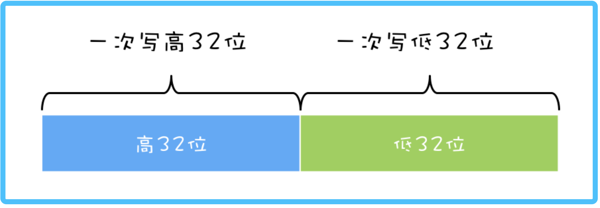
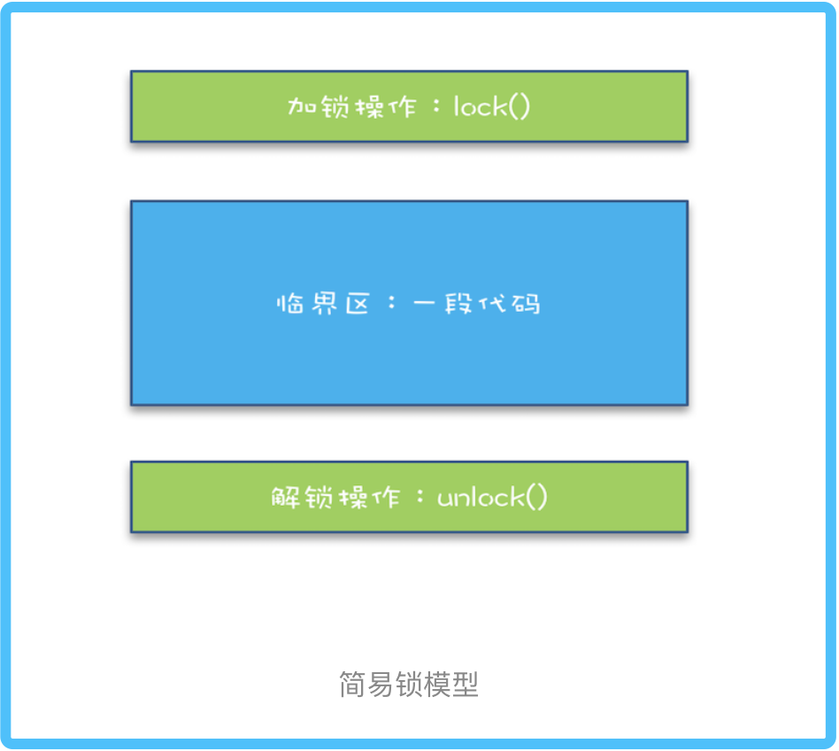
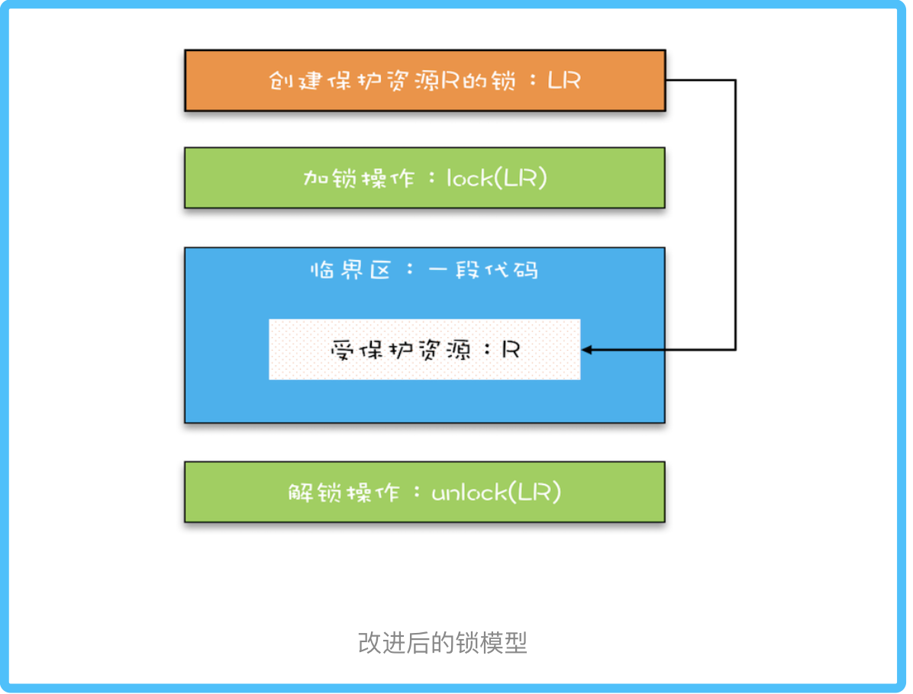

# 03 | 互斥锁（上）：解决原子性问题

## 背景
###     那原子性问题到底该如何解决呢？     
你已经知道，原子性问题的源头是线程切换，如果能够禁用线程切换那不就能解决这个问题了吗？
而操作系统做线程切换是依赖 CPU 中断的，所以禁止 CPU 发生中断就能够禁止线程切换。        


在早期单核 CPU 时代，这个方案的确是可行的，而且也有很多应用案例，但是并不适合多核场景。
这里我们以 32 位 CPU 上执行 long 型变量的写操作为例来说明这个问题，long 型变量是 64 位，
在 32 位 CPU 上执行写操作会被拆分成两次写操作（写高 32 位和写低 32 位，如下图所示）。
      

单核 CPU 场景下:     
同一时刻只有一个线程执行，禁止 CPU 中断，意味着操作系统不会重新调度线程，
也就是禁止了线程切换，获得 CPU 使用权的线程就可以不间断地执行，所以两次写操作一定是：要么都被执行，
要么都没有被执行，具有原子性。

多核CPU场景下:      
同一时刻，有可能有两个线程同时在执行，一个线程执行在 CPU-1 上，一个线程执行在 CPU-2 上，
此时禁止 CPU 中断，只能保证 CPU 上的线程连续执行，并不能保证同一时刻只有一个线程执行，
如果这两个线程同时写 long 型变量高 32 位的话，那就有可能出现我们开头提及的诡异 Bug 了。

【注意】“同一时刻只有一个线程执行”这个条件非常重要，我们称之为互斥。
如果我们能够保证对共享变量的修改是互斥的，那么，无论是单核 CPU 还是多核 CPU，就都能保证原子性了。


## 开胃菜：简易锁模型
当谈到互斥，相信聪明的你一定想到了那个杀手级解决方案：锁。同时大脑中还会出现以下模型：     
      
我们把一段需要互斥执行的代码称为临界区。        
线程在进入临界区之前，首先尝试加锁 lock()，如果成功，则进入临界区，此时我们称这个线程持有锁；      
否则呢就等待，直到持有锁的线程解锁；持有锁的线程执行完临界区的代码后，执行解锁 unlock()。

这个过程非常像办公室里高峰期抢占坑位，每个人都是进坑锁门（加锁），出坑开门（解锁），
入厕这个事就是临界区。很长时间里，我也是这么理解的！！！        
这样理解本身没有问题，但却很容易让我们忽视两个非常非常重要的点：我们锁的是什么？我们保护的又是什么？
（亲身感受，的确是这样，之前一直都忽略了这个，作者强调的太对了）

## 改进后的锁模型      
我们知道在现实世界里，锁和锁要保护的资源是有对应关系的，比如你用你家的锁保护你家的东西，我用我家的锁保护我家的东西。      
在并发编程世界里，锁和资源也应该有这个关系，但这个关系在我们上面的模型中是没有体现的，所以我们需要完善一下我们的模型。     
       
首先，我们要把临界区要保护的资源标注出来，如图中临界区里增加了一个元素：受保护的资源 R；       
其次，我们要保护资源 R 就得为它创建一把锁 LR；      
最后，针对这把锁 LR，我们还需在进出临界区时添上加锁操作和解锁操作。     
另外，在锁 LR 和受保护资源之间，我特地用一条线做了关联，这个关联关系非常重要！！！
很多并发 Bug 的出现都是因为把它忽略了，然后就出现了类似锁自家门来保护他家资产的事情，这样的 Bug 非常不好诊断，因为潜意识里我们认为已经正确加锁了。

## Java 语言提供的锁技术：synchronized       
锁是一种通用的技术方案，Java 语言提供的 synchronized 关键字，就是锁的一种实现。
synchronized 关键字可以用来修饰方法，也可以用来修饰代码块，它的使用示例基本上都是下面这个样子：
```java
/**
 * @Author gaoqiangwei
 * @Date 2020/5/26 23:49
 * @Description
 */
public class X {
    synchronized void foo() {
        //锁一个非静态方法
    }

    synchronized static void bar() {
        //锁一个静态方法
    }

    Object obj = new Object();
    void baz() {
        //锁一段代码块
        synchronized (obj) {
            //临界区
        }
    }

}
```

看完之后你可能会觉得有点奇怪，这个和我们上面提到的模型有点对不上号啊，加锁 lock() 和解锁 unlock() 在哪里呢？
其实这两个操作都是有的，只是这两个操作是被 Java 默默加上的，
Java 编译器会在 synchronized 修饰的方法或代码块前后自动加上加锁 lock() 和解锁 unlock()，
这样做的好处就是加锁 lock() 和解锁 unlock() 一定是成对出现的!!!
毕竟忘记解锁 unlock() 可是个致命的 Bug（意味着其他线程只能死等下去了）。

那 synchronized 里的加锁 lock() 和解锁 unlock() 锁定的对象在哪里呢？上面的代码我们看到只有修饰代码块的时候，锁定了一个 obj 对象，那修饰方法的时候锁定的是什么呢？这个也是 Java 的一条隐式规则：
> 当修饰静态方法的时候，锁定的是当前类的 Class 对象，在上面的例子中就是 Class X；
> 当修饰非静态方法的时候，锁定的是当前实例对象 this。

对于上面的例子，synchronized 修饰静态方法相当于:
```text
class X{
    // 修饰静态方法
    synchronized(X.class) static void foo(){
        //临界区
    }
}
```
修饰非静态方法，相当于：
```text
class X{
    //修饰非静态方法
    synchronized(this) void bar() {
        //临界区
    }
}
```

## 用 synchronized 解决 count+=1 问题        
相信你一定记得我们前面文章中提到过的 count+=1 存在的并发问题，现在我们可以尝试用 synchronized 来小试牛刀一把，代码如下所示。      


