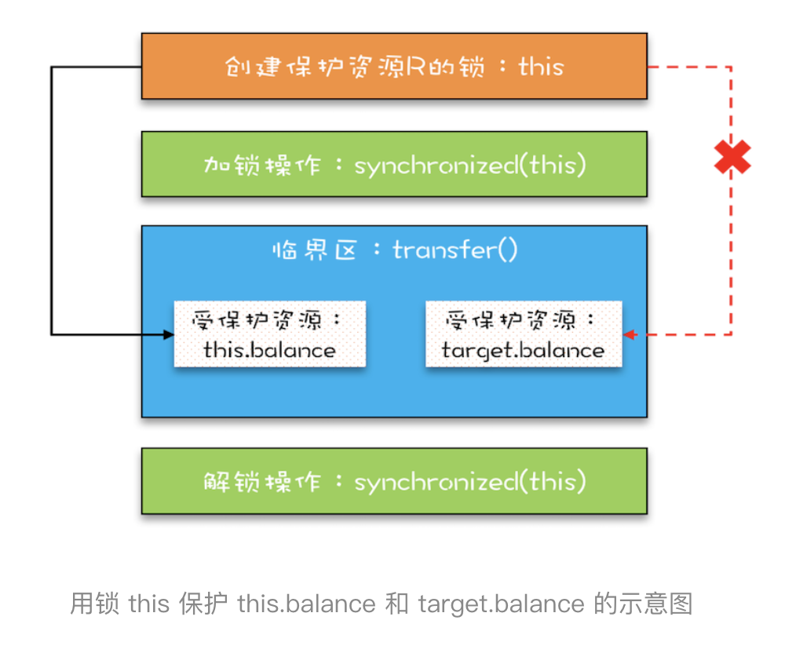
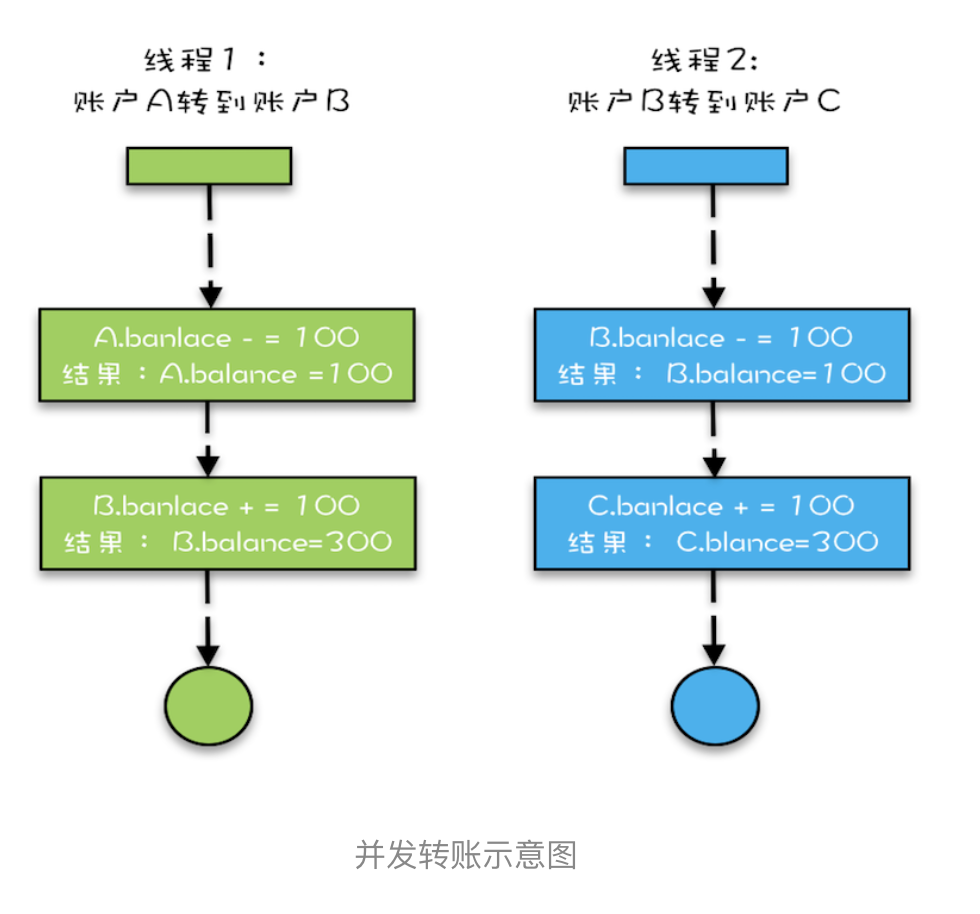
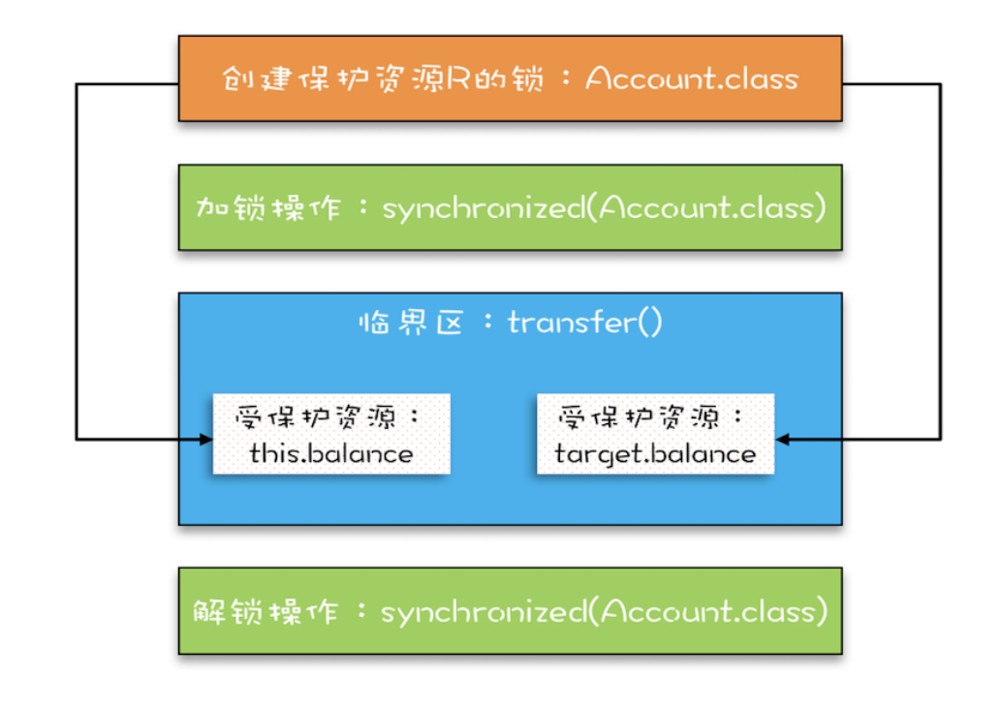

# 04 | 互斥锁（下）：如何用一把锁保护多个资源？
>受保护资源和锁之间合理的关联关系应该是 N:1 的关系

## 保护没有关联关系的多个资源        
例如，银行业务中有针对账户余额（余额是一种资源）的取款操作，也有针对账户密码（密码也是一种资源）的更改操作，
我们可以为账户余额和账户密码分配不同的锁来解决并发问题，这个还是很简单的。（这2者没有什么联系）


代码如下：       
```java
/**
 * @Author gaoqiangwei
 * @Date 2020/5/27 22:13
 * @Description
 */
public class Account {

    private final Object balLock = new Object();
    private Integer balance;

    private final Object pwdLock = new Object();
    private String password;

    //【取款】
    public void withDraw(Integer amt) {
        synchronized (balLock) {
            if (balance > amt) {
                balance -= amt;
            }
        }
    }
    //【查看余额】
    public Integer getWithDraw() {
        synchronized (balLock) {
            return balance;
        }
    }
    //【更新密码】
    public void updatePassword(String newPwd) {
        synchronized (pwdLock) {
            password = newPwd;
        }
    }
    //【查看密码】
    public String getPassword() {
        synchronized (pwdLock){
            return password;
        }
    }
}
```
        
        
解释：     
- 账户类 Account 有两个成员变量，分别是账户余额 balance 和账户密码 password。
- 取款 withdraw() 和查看余额 getBalance() 操作会访问账户余额 balance，我们创建一个 final 对象 balLock 作为锁；
- 更改密码 updatePassword() 和查看密码 getPassword() 操作会修改账户密码 password，我们创建一个 final 对象 pwLock 作为锁       

结论：     
不同的资源用不同的锁保护，各自管各自的，很简单     

额外：     
当然，我们也可以用同一个互斥锁来保护所有资源，比如this，
但是用一把锁有个问题，就是性能太差，会导致取款、查看余额、修改密码、查看密码这四个操作都是串行的。
而我们用两把锁，取款和修改密码是可以并行的。
> 用不同的锁对受保护资源进行精细化管理，能够提升性能。这种锁还有个名字，叫细粒度锁！！！（一般越小越好）       


## 保护有关联关系的多个资源
举例：比如A/B两个账号，现在，A要给B转账一笔钱，那么怎么保证不会并发呢？      
```java
/**
 * @Author gaoqiangwei
 * @Date 2020/5/27 22:22
 * @Description
 */
public class Account1 {

    private Integer balance;

    public void transfer(Account1 target,Integer amt) {
        if (balance > amt) {
            balance -= amt;
            target.balance += amt;
        }
    }
}
```
直觉告诉你这样应该就可以了，是吗？于是你很快完成了下面这个样子
```
    public synchronized void transfer1(Account1 target,Integer amt) {
        if (balance > amt) {
            balance -= amt;
            target.balance += amt;
        }
    }
}
```     

在这段代码中，临界区内有两个资源，分别是转出账户的余额 this.balance 和转入账户的余额 target.balance，
并且用的是一把锁 this，符合我们前面提到的，多个资源可以用一把锁来保护，这看上去完全正确呀。真的是这样吗？
可惜，这个方案仅仅是看似正确，为什么呢？        

问题就出在 this 这把锁上，this 这把锁可以保护自己的余额 this.balance，却保护不了别人的余额 target.balance，
就像你不能用自家的锁来保护别人家的资产。        
如下图：        


- - -
下面我们分析一个例子：     
假设，A/B/C三个账户，三个初始金额都是200，现在A给B转100，B给C转100，最后应该是A100 B200 C300            
这两个线程假设是2个CPU上执行，那么结果是什么样的呢？结果有可能：      
- 1、结果：A100 B300 C300 （线程1后执行于线程2，导致线程1结果覆盖了线程2结果）
- 2、结果：A100 B100 C300 （线程2后执行与线程1，导致线程2结果覆盖了线程1结果）
- 3、正常（A100 B200 C300）       



## 使用锁的正确姿势     
上一章，我们提到包场的情况，即一把锁可以锁多个资源，那编程里呢？很简单，只要"我们的锁能覆盖所有要保护的资源"就好了。
     
上面的例子里，两个线程的锁都是各自的this对象级别的锁，A对象和B对象都有自己的锁，那如何让A对象和B对象拥有共同的一把锁呢？        
很简单，让所有线程拥有一个"共同的唯一一把锁"就可以了，具体如下：       
构造参数私有化，然后创建account对象时，都传入一个共同的对象就可以了！
```java
public class Account2 {

    private Integer balance;

    private Object lock;

    private Account2(Object lock) {
        this.lock = lock;
    }

    public void transfer(Account2 target, Integer amt) {
        synchronized (lock) {
            if (balance > amt) {
                balance -= amt;
                target.balance += amt;
            }
        }
    }
}
```
点评：这个办法确实能解决，但是有点小瑕疵，一旦传入的对象不是同一个，那就自家锁保护他家资产了，而且在真实的项目中，创建account对象        
的代码可能分布在不同的工程，因此，传入共享的lock很难，缺乏可行性！

### 改进      
上面的方案缺乏实践的可行性，我们需要更好的方案。还真有，就是用 Account.class 作为共享的锁。    
> Account.class 是所有 Account 对象共享的，而且这个对象是 Java 虚拟机在加载 Account 类的时候创建的，所以我们不用担心它的唯一性。使用 Account.class 作为共享的锁，我们就无需在创建 Account 对象时传入了，代码更简单。      
```text
public class Account2 {

    private Integer balance;

    public void transfer1(Account2 target, Integer amt) {
        synchronized (Account2.class) {
            if (balance > amt) {
                balance -= amt;
                target.balance += amt;
            }
        }
    }
}
```
下面这幅图很直观地展示了我们是如何使用共享的锁 Account.class 来保护不同对象的临界区的。     


# 总结        
相信你看完这篇文章后，对如何保护多个资源已经很有心得了，关键是要分析多个资源之间的关系。如果资源之间没有关系，很好处理，每个资源一把锁就可以了。如果资源之间有关联关系，就要选择一个粒度更大的锁，这个锁应该能够覆盖所有相关的资源。除此之外，还要梳理出有哪些访问路径，所有的访问路径都要设置合适的锁；

我们再引申一下上面提到的关联关系，关联关系如果用更具体、更专业的语言来描述的话，其实是一种“原子性”特征，在前面的文章中，我们提到的原子性，主要是面向 CPU 指令的，转账操作的原子性则是属于是面向高级语言的，不过它们本质上是一样的。       

“原子性”的本质是什么？其实不是不可分割，不可分割只是外在表现，其本质是多个资源间有一致性的要求，操作的中间状态对外不可见。      
例如，在 32 位的机器上写 long 型变量有中间状态（只写了 64 位中的 32 位），在银行转账的操作中也有中间状态（账户 A 减少了 100，账户 B 还没来得及发生变化）。所以解决原子性问题，是要保证中间状态对外不可见。

# 课后思考      
第1个例子里，我们是通过final Object xxxLock = new Object()创建2个不同的对象来保护不同资源，那么可否用
this.balance和this.password呢？


